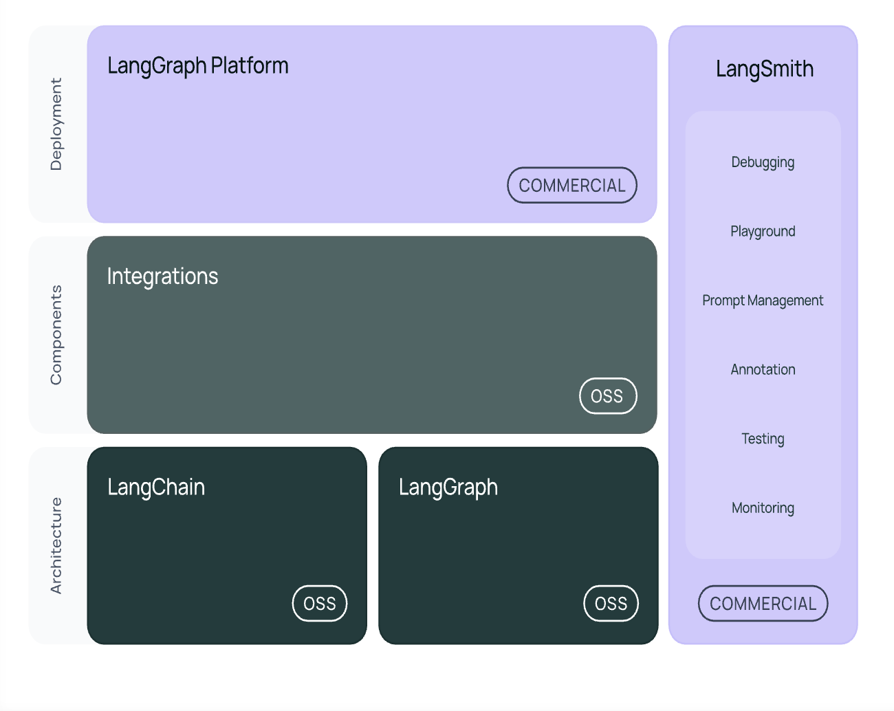

问题
Generative AI的6层架构是什么？
基础设施层：GPU、云计算等算力资源。
架构层：Transformer、MoE 等模型架构，是大模型的技术基础。
基础模型层：GPT、Claude、Llama、Qwen 等预训练大模型。
LLM 层：针对不同场景优化后的具体模型。
API 层：通过 API 向开发者提供模型能力。
应用层：ChatGPT、Copilot、Notion AI 等面向用户的 AI 产品。


问题
Agenentic AI 的8层架构是什么?
* 基础设施层：GPU、云服务器、数据库等，提供运行环境。
* Agent网络层：多个 Agent 协同工作与通信。
* 协议层：统一 Agent 与工具间的通信标准（如 MCP）。
* 工具层：连接搜索、数据库、Python、API 等外部能力。
* 认知层：负责规划、推理、决策和任务拆解，是 Agent 的“大脑”。
* 记忆层：保存对话历史、长期记忆和用户偏好，实现个性化。
* 应用层：将上述能力组合成 AI 助手、编程、客服等具体产品。
* 运维治理层：负责部署、监控、安全、权限和成本管理。
核心记忆：Agent = 大模型（认知）+ 工具 + 记忆 + 多 Agent 协作。学习 LangChain/LangGraph 重点关注第 4～6 层。


问题
Generative AI 和Agentic AI的区别和联系是什么？
| Generative AI                  | Agentic AI                                |
| -------------------------------| ------------------------------------------|
| 如何训练和提供一个大模型           | 如何利用大模型构建智能体                      |
| 关注模型（Model）                | 关注智能体（Agent）                         |
| 核心：Transformer、LLM、API      | 核心：Reasoning、Tool、Memory、Multi-Agent  |


问题
构建 AI Agent 的六种核心工作流（Workflow）设计模式？
| 模式                       | 核心思想         | 一句话理解                     |
| ------------------------ | ------------ | ------------------------- |
| **Prompt Chaining**      | 顺序执行多个 LLM   | **固定流水线**，前一步输出作为后一步输入。   |
| **Routing**              | 根据任务选择不同 LLM | **智能分流**，让最合适的模型处理任务。     |
| **Parallelization**      | 多个 LLM 并行处理  | **多人同时工作**，最后汇总结果，提高效率。   |
| **Orchestrator–Workers** | 动态拆分任务并分配    | **项目经理带团队**，按需分工协作完成复杂任务。 |
| **Evaluator–Optimizer**  | 生成→评估→优化循环   | **AI 自我迭代**，不断改进直到满足要求。   |
| **Autonomous Agent**     | 持续感知、决策、行动   | **AI 自主完成目标**，通过环境反馈不断执行。 |


问题
.env 与系统环境变量存在同名 v3_api 且值不同，程序会读取哪个？

答案
默认系统环境变量优先级更高，.env 不会覆盖它；加载 env 库开启 override 强制覆盖参数后，才会取.env 内的值。


问题
Function Calling和普通的程序调用接口有什么区别？
普通函数调用由程序员写死：调用哪个函数、何时调用、参数是什么都提前确定。
Function Calling则由大模型理解用户自然语言，自主选择合适的函数并生成参数，程序再实际执行函数并将结果返回给模型生成最终回答。


问题
LangChain和LangGraph的区别？
LangChain 是“工具库”，LangGraph 是“流程引擎”。
LangChain：负责让大模型调用工具、组织 Prompt、串联流程，适合线性工作流。
LangGraph：负责管理 Agent 的状态和执行流程，适合复杂、多轮、可循环、可恢复的工作流。

问题
如何让AI调用数据库？ 如何让AI分步骤解决问题？如何让多个AI协同工作？
                    用户任务
                       │
                       ▼
        Multi-Agent（多个AI协作）
      负责分工、协同、汇总结果
                       │
      ┌────────┼────────┐
      ▼        ▼        ▼
   Agent A   Agent B   Agent C
      │        │        │
      ▼        ▼        ▼
 Workflow（步骤编排）
 将复杂任务拆解为多个步骤，
 按顺序、条件或循环执行
      │
      ▼
 Tool Calling（工具调用）
 调用数据库、API、搜索、
 知识库、代码等外部能力

 三层能力模型：

Tool Calling：让 AI 能调用数据库、API、搜索等工具，获取或操作外部数据。
Workflow：让 AI 将复杂任务拆解为多个步骤，并按流程执行。
Multi-Agent：让多个 AI 各司其职、协同合作，共同完成复杂任务。

一句话总结：
Tool Calling 决定 AI 能做什么，Workflow 决定 AI 如何做，Multi-Agent 决定由谁来做。


视频 https://u.geekbang.org/lesson/842?article=938981&utm_term=timewebmenu&utm_source=time_web&utm_medium=menu
谁来决定Function Calling
1. 用户要定义好函数 名字和描述都要对
2. 模型要支持Function Calling的能力
代码位置 week01->04-2ToolCalls.py

代码理解：
问题：问什么function calling后模型会返回一个tool_calls.id?
回答：因为同一次对话中是可以对函数发起多次调用的

笔记：使用枚举类型，可以避免大模型的反向强调问题（比如，不要白色的，很容易被大模型理解为白色的）
{
    "type": "function",
    "name": "get_weather",
    "description": "Retrieves current weather for the given location.",
    "strict": true,
    "parameters": {
        "type": "object",
        "properties": {
            "location": {
                "type": "string",
                "description": "City and country e.g. Bogotá, Colombia"
            },
            "units": {
                "type": ["string", "null"],
                "enum": ["celsius", "fahrenheit"],
                "description": "Units the temperature will be returned in."
            }
        },
        "required": ["location", "units"],
        "additionalProperties": false
    }
}

理解：不要让模型填充你已知的参数，能自己填就自己填。

问题：Function Call到底分为几个过程？这几个过程为什么这么设计？


问题： 用户问：某个地方在2026年6月1日天气如何？
答案：1 怎样设计Function Call: 当你知道参数的时候，就不要让模型帮你实现，比如日期，直接让服务器实现。关键是要知道城市
2 分成几个步骤: 1 定义工具 2 基于用户的提问和tool发给大模型看大模型返回什么，如果返回不对优化提示词 
3 怎样定义工具
4 你能描述运行过程吗？


问题：Function Call和MCP有什么相同点和异同点？

差别1：MCP从服务器上获取工具列表

备注
LangGraph Platform一般被云厂商所替代


5 callback
回调：特定操作发生时执行预定处理程序的机制
分为两种实现方式
1 构造器回调
2 请求回调

回调地狱
回调地狱：代码里一层套一层地写回调函数，导致逻辑越来越往右缩进，阅读、维护、错误处理都变得困难。

例子：先登录，再获取用户信息，再获取订单。
```js
login(username, password, function (loginErr, token) {
  if (loginErr) {
    console.error("登录失败", loginErr);
    return;
  }

  getUserInfo(token, function (userErr, user) {
    if (userErr) {
      console.error("获取用户信息失败", userErr);
      return;
    }

    getOrders(user.id, function (orderErr, orders) {
      if (orderErr) {
        console.error("获取订单失败", orderErr);
        return;
      }

      console.log("用户订单：", orders);
    });
  });
});
```

这里的结构是：
```text
login
  -> getUserInfo
      -> getOrders
```

每一步都依赖上一步的结果，所以回调不断嵌套。业务复杂后，代码会变成很深的“金字塔形代码”。

Promise / Future 扁平化
Promise 和 Future 都表示“一个未来才会有结果的值”。比如发起网络请求时，结果还没回来，但程序可以先拿到一个 Promise/Future，它代表未来会成功得到结果，或者失败得到错误。

所谓“扁平化”，是指不用一层层嵌套回调，而是把异步流程铺平成链式结构：
```js
login(username, password)
  .then(token => getUserInfo(token))
  .then(user => getOrders(user.id))
  .then(orders => {
    console.log("用户订单：", orders);
  })
  .catch(err => {
    console.error("操作失败", err);
  });
```

Promise 常见于 JavaScript，Future 常见于 Java、Scala、Python、Dart 等语言。本质上都类似：表示“异步任务未来的结果”。

Async / Await 以同步风格写异步代码
async/await 是在 Promise/Future 之上的更易读写法。它让异步代码看起来像同步代码：
```js
async function main() {
  try {
    const token = await login(username, password);
    const user = await getUserInfo(token);
    const orders = await getOrders(user.id);

    console.log("用户订单：", orders);
  } catch (err) {
    console.error("操作失败", err);
  }
}
```

一句话总结：
Promise/Future 是把异步结果封装成“未来的值”，让流程从嵌套变成链式扁平；async/await 是在这个基础上，让异步代码写起来像普通同步代码。

6 LCEL
