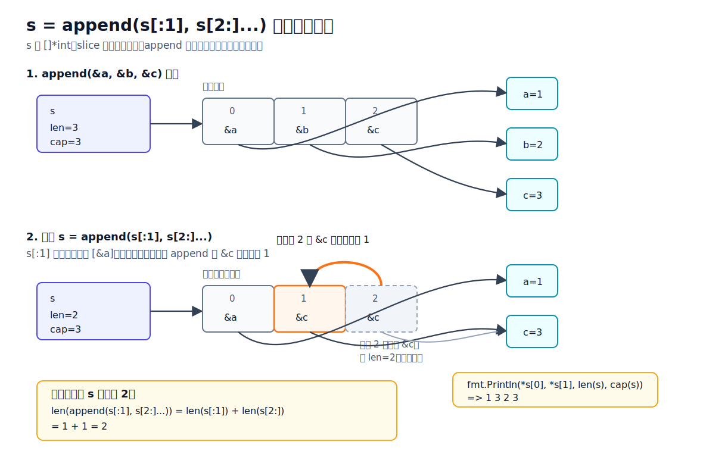

# Go slice、map 和 WaitGroup 最容易犯错的输出题

**适用场景：** Go slice 底层数组、长度容量、`append` 扩容、共享底层数组、函数传参、`range` 变量、删除元素、nil slice、nil map、map 读写、map 遍历顺序和并发安全、`sync.WaitGroup` 任务等待和常见误用。

**回答模板：** slice 先看 `len` 和 `cap`，再判断是否共享底层数组；遇到 `append` 先判断是否扩容。map 先看是不是 nil map，再区分读、写、删除和遍历；最后记住 map 赋值和传参会共享同一张运行时哈希表。`WaitGroup` 先看 `Add`、`Done`、`Wait` 的顺序，再看计数器是否归零、是否被复制、是否可能漏掉 `Done`。

## 目录

- [一、Slice 易错点](#一slice-易错点)
  - [1. append 与底层数组](#1-append-与底层数组)
    - [1.1 append 以后没有接住返回值](#11-append-以后没有接住返回值)
    - [1.2 子切片 append 覆盖原数组](#12-子切片-append-覆盖原数组)
    - [1.3 append 扩容后不再共享底层数组](#13-append-扩容后不再共享底层数组)
    - [1.4 三索引切片限制容量](#14-三索引切片限制容量)
    - [1.5 扩容后旧 slice 和新 slice 分家](#15-扩容后旧-slice-和新-slice-分家)
    - [1.6 预分配容量减少扩容次数](#16-预分配容量减少扩容次数)
  - [2. 函数传参与共享语义](#2-函数传参与共享语义)
    - [2.1 函数里 append 影响不到外层长度](#21-函数里-append-影响不到外层长度)
    - [2.2 函数里修改元素能影响外层](#22-函数里修改元素能影响外层)
  - [3. range 与删除](#3-range-与删除)
    - [3.1 range 里修改循环变量没有用](#31-range-里修改循环变量没有用)
    - [3.2 range 开始前长度已经确定](#32-range-开始前长度已经确定)
    - [3.3 删除元素后尾部仍然可能被引用](#33-删除元素后尾部仍然可能被引用)
  - [4. 基础概念与边界](#4-基础概念与边界)
    - [4.1 nil slice 和空 slice 不完全一样](#41-nil-slice-和空-slice-不完全一样)
    - [4.2 len 和 cap 不是一回事](#42-len-和-cap-不是一回事)
- [二、Map 易错点](#二map-易错点)
  - [1. nil map 与读写判断](#1-nil-map-与读写判断)
    - [1.1 nil map 可以读，不能写](#11-nil-map-可以读不能写)
    - [1.2 读取不存在的 key 返回零值](#12-读取不存在的-key-返回零值)
    - [1.3 用逗号 ok 区分不存在和零值](#13-用逗号-ok-区分不存在和零值)
  - [2. 共享与传参](#2-共享与传参)
    - [2.1 map 赋值后共享同一份数据](#21-map-赋值后共享同一份数据)
    - [2.2 函数里修改 map 会影响外层](#22-函数里修改-map-会影响外层)
  - [3. 遍历顺序与遍历修改](#3-遍历顺序与遍历修改)
    - [3.1 range map 的顺序不固定](#31-range-map-的顺序不固定)
    - [3.2 遍历 map 时删除 key 是允许的](#32-遍历-map-时删除-key-是允许的)
    - [3.3 遍历 map 时新增 key 不要依赖是否会遍历到](#33-遍历-map-时新增-key-不要依赖是否会遍历到)
  - [4. 并发安全与加锁](#4-并发安全与加锁)
    - [4.1 并发读写 map 可能直接崩溃](#41-并发读写-map-可能直接崩溃)
    - [4.2 sync.Mutex 和 sync.RWMutex 保护 map 的区别](#42-syncmutex-和-syncrwmutex-保护-map-的区别)
- [三、WaitGroup 易错点](#三waitgroup-易错点)
  - [1. 计数器增减](#1-计数器增减)
    - [1.1 WaitGroup 没有 Done 会一直等](#11-waitgroup-没有-done-会一直等)
    - [1.2 Done 次数超过 Add 会 panic](#12-done-次数超过-add-会-panic)
  - [2. Add、go、Wait 的时序](#2-addgowait-的时序)
    - [2.1 Add 放到 goroutine 里可能等了个寂寞](#21-add-放到-goroutine-里可能等了个寂寞)
    - [2.2 循环启动 goroutine 时要先 Add 再 go](#22-循环启动-goroutine-时要先-add-再-go)
  - [3. 传参与复制](#3-传参与复制)
    - [3.1 WaitGroup 使用后不要复制](#31-waitgroup-使用后不要复制)
- [四、总结口诀](#四总结口诀)

---

## 一、Slice 易错点

### 1. append 与底层数组

#### 1.1 append 以后没有接住返回值

先判断输出：

```go
func main() {
    s := []int{1, 2}
    append(s, 3)
    fmt.Println(s)
}
```

这段代码**编译不通过**：

```text
append(s, 3) (value of type []int) is not used
```

原因：`append` 会返回新的 slice header，必须接住返回值。正确写法是：

```go
s = append(s, 3)
fmt.Println(s) // [1 2 3]
```

一句话记忆：**`append` 不是原地语句，它是有返回值的函数。**

---

#### 1.2 子切片 append 覆盖原数组

先判断输出：

```go
func main() {
    a := []int{1, 2, 3, 4}
    b := a[:2]

    b = append(b, 99)

    fmt.Println(a)
    fmt.Println(b)
}
```

输出：

```text
[1 2 99 4]
[1 2 99]
```

原因：`b := a[:2]` 后，`b` 的长度是 2，容量还是 4。  
`append(b, 99)` 时容量够用，不会扩容，所以直接把 `99` 写到原底层数组的第 3 个位置，覆盖了原来的 `3`。

可以把它想成：

```text
a: [1 2 3 4]
b: [1 2]      len=2 cap=4

append(b, 99)

底层数组变成: [1 2 99 4]
```

一句话记忆：**子切片容量没被限制时，append 可能改到原 slice 后面的元素。**

---

#### 1.3 append 扩容后不再共享底层数组

先判断输出：

```go
func main() {
    a := []int{1, 2, 3, 4}
    b := a[:2:2]

    b = append(b, 99)

    fmt.Println(a)
    fmt.Println(b)
}
```

输出：

```text
[1 2 3 4]
[1 2 99]
```

原因：`b := a[:2:2]` 是三索引切片，第三个索引用来限制容量。  
此时 `b` 的长度是 2，容量也是 2。再 `append` 一个元素时容量不够，会分配新的底层数组，所以不会覆盖 `a`。

对比上一题：

```go
b := a[:2]   // len=2 cap=4，append 可能覆盖 a
b := a[:2:2] // len=2 cap=2，append 会扩容
```

一句话记忆：**容量够就共享着写，容量不够就扩容搬家。**

---

#### 1.4 三索引切片限制容量

先判断输出：

```go
func main() {
    a := []int{1, 2, 3, 4, 5}
    b := a[1:3]
    c := a[1:3:3]

    fmt.Println(len(b), cap(b))
    fmt.Println(len(c), cap(c))
}
```

输出：

```text
2 4
2 2
```

原因：

```go
b := a[1:3]
```

`b` 从下标 1 开始，到下标 3 结束，长度是 `3 - 1 = 2`。  
容量从下标 1 一直算到底层数组末尾，所以是 `5 - 1 = 4`。

```go
c := a[1:3:3]
```

三索引切片的容量是 `第三个索引 - 第一个索引`，所以是 `3 - 1 = 2`。

三索引切片的完整格式是：

```go
s[low:high:max]
```

公式：

```text
len = high - low
cap = max - low
```

比如这个常见写法：

```go
a := []int{1, 2, 3, 4}
b := a[:2:2]
```

它等价于：

```go
b := a[0:2:2]
```

所以：

```text
low  = 0
high = 2
max  = 2

b   = [1 2]
len = 2 - 0 = 2
cap = 2 - 0 = 2
```

它和普通切片最大的区别是容量不同：

```go
b := a[:2]   // len=2 cap=4
b := a[:2:2] // len=2 cap=2
```

普通切片 `a[:2]` 的容量还能看到底层数组后面的空间，所以 `append` 可能覆盖原数组：

```go
a := []int{1, 2, 3, 4}
b := a[:2]

b = append(b, 99)

fmt.Println(a) // [1 2 99 4]
fmt.Println(b) // [1 2 99]
```

三索引切片 `a[:2:2]` 把容量限制成 2，再 `append` 时容量不够，只能扩容分配新数组：

```go
a := []int{1, 2, 3, 4}
b := a[:2:2]

b = append(b, 99)

fmt.Println(a) // [1 2 3 4]
fmt.Println(b) // [1 2 99]
```

一句话记忆：**两索引容量看到数组末尾，三索引容量被第三个索引卡住。**

再短一点：**普通切片主要控制 `len`，三索引切片同时控制 `len` 和 `cap`。**

---

#### 1.5 扩容后旧 slice 和新 slice 分家

先判断输出：

```go
func main() {
    s := make([]int, 2, 2)
    s[0], s[1] = 1, 2

    t := append(s, 3)
    t[0] = 99

    fmt.Println("s:", s, len(s), cap(s))
    fmt.Println("t:", t, len(t), cap(t))
}
```

输出：

```text
s: [1 2] 2 2
t: [99 2 3] 3 4
```

原因：`s` 一开始 `len=2 cap=2`，已经没有剩余容量。  
`append(s, 3)` 时容量不够，运行时会新建一个更大的底层数组，把旧元素拷过去，再追加 `3`。

此时：

```text
s -> 旧底层数组: [1 2]
t -> 新底层数组: [1 2 3]
```

所以后面执行：

```go
t[0] = 99
```

只会修改 `t` 的新底层数组，不会影响 `s`。

注意：这里 `cap(t)` 常见输出是 4，因为小 slice 扩容时通常会翻倍。面试里更重要的是判断：**已经扩容，所以 `s` 和 `t` 不再共享底层数组。**

一句话记忆：**append 触发扩容后，新旧 slice 通常已经不是同一块底层数组。**

---

#### 1.6 预分配容量减少扩容次数

先判断输出：

```go
func main() {
    a := make([]int, 0, 1)
    b := make([]int, 0, 4)

    for i := 0; i < 4; i++ {
        a = append(a, i)
        b = append(b, i)
        fmt.Println(i, len(a), cap(a), len(b), cap(b))
    }
}
```

常见输出：

```text
0 1 1 1 4
1 2 2 2 4
2 3 4 3 4
3 4 4 4 4
```

原因：`a := make([]int, 0, 1)` 只预留了 1 个容量，随着不断 `append`，容量不够时会触发扩容。  
`b := make([]int, 0, 4)` 一开始就预留了 4 个容量，前 4 次 `append` 都不需要扩容，所以 `cap(b)` 一直是 4。

注意：Go 的具体扩容容量会受版本、元素大小和内存分配规格影响。比如有些 Go 版本里，`make([]int, 0)` 第一次 append 后的容量不一定是 1。小 slice 常见是翻倍增长，但不要在业务逻辑里依赖精确扩容数值。面试题里重点看两件事：

```text
len 会随着 append 增加
cap 只有容量不够时才会增长
```

一句话记忆：**知道大概元素数量时，用 `make([]T, 0, n)` 预分配容量，可以减少扩容和拷贝。**

---

### 2. 函数传参与共享语义

#### 2.1 函数里 append 影响不到外层长度 （易错）

先判断输出：

```go
func add(s []int) {
    s = append(s, 3)
    fmt.Println("inside:", s, len(s), cap(s))
}

func main() {
    s := make([]int, 0, 3)
    s = append(s, 1, 2)

    add(s)

    fmt.Println("outside:", s, len(s), cap(s))
}
```

输出：

```text
inside: [1 2 3] 3 3
outside: [1 2] 2 3
```

原因：slice 传参会复制 slice header，也就是复制一份 `{ptr, len, cap}`。  
函数里的 `append` 改的是函数内部那份 slice header 的 `len`，外层 `s` 的长度还是 2。

注意：底层数组里其实可能已经写入了 `3`，只是外层 `s` 的长度看不到它。

一句话记忆：**函数里 append 后如果想影响外层，要返回新的 slice。**

正确写法：

```go
func add(s []int) []int {
    return append(s, 3)
}

s = add(s)
```

---

#### 2.2 函数里修改元素能影响外层

先判断输出：

```go
func change(s []int) {
    s[0] = 99
}

func main() {
    s := []int{1, 2, 3}
    change(s)
    fmt.Println(s)
}
```

输出：

```text
[99 2 3]
```

原因：slice header 虽然是值传递，但 header 里的 `ptr` 指向同一个底层数组。  
函数里 `s[0] = 99` 修改的是底层数组，所以外层能看到。

和上一题对比：

| 操作 | 是否影响外层 |
|---|---|
| `s[0] = 99` | 能，因为改的是底层数组 |
| `s = append(s, 3)` | 不一定，因为改的是内部 slice header |

一句话记忆：**改元素能看到，改长度看不到，除非把新 slice 返回去。**

---

### 3. range 与删除

#### 3.1 range 里修改循环变量没有用 （易错）

先判断输出：

```go
func main() {
    s := []int{1, 2, 3}

    for _, v := range s {
        v *= 10
    }

    fmt.Println(s)
}
```

输出：

```text
[1 2 3]
```

原因：`range` 的第二个变量 `v` 是元素值的一份拷贝。  
修改 `v` 不会改到底层数组。

正确写法：

```go
for i := range s {
    s[i] *= 10
}

fmt.Println(s) // [10 20 30]
```

一句话记忆：**range 的 value 是拷贝，想改原 slice 就用下标。**

---

#### 3.2 range 开始前长度已经确定（易错）

先判断输出：

```go
func main() {
    s := []int{1, 2, 3}

    for _, v := range s {
        fmt.Println(v)
        s = append(s, v+10)
    }

    fmt.Println("final:", s)
}
```

输出：

```text
1
2
3
final: [1 2 3 11 12 13]
```

原因：`range` 开始时，会先确定要遍历的长度。  
循环过程中追加的新元素会进入 slice，但不会被本轮 `range` 继续遍历。

一句话记忆：**range 不会因为你 append 了元素就无限循环。**

---

#### 3.3 删除元素后尾部仍然可能被引用 （易错）

先判断输出：

```go
func main() {
    s := []*int{}
    a, b, c := 1, 2, 3
    s = append(s, &a, &b, &c)

    s = append(s[:1], s[2:]...)

    fmt.Println(*s[0], *s[1], len(s), cap(s))
}
```

输出：

```text
1 3 2 3
```

图解：



原因：`append(s[:1], s[2:]...)` 是常见删除写法，会把后面的元素往前挪。  
删除后逻辑上只剩 `[&a, &c]`，所以打印 `1 3`。

但要注意，底层数组的尾部位置可能还残留旧引用。对于保存指针或大对象的 slice，如果长期持有这个底层数组，可能导致本该释放的对象还被引用。

更稳的写法是删除后把尾部清掉：

```go
copy(s[1:], s[2:])
s[len(s)-1] = nil
s = s[:len(s)-1]
```

一句话记忆：**删除指针元素时，只缩短长度不一定等于清掉引用。**

---

### 4. 基础概念与边界

#### 4.1 nil slice 和空 slice 不完全一样

先判断输出：

```go
func main() {
    var a []int
    b := []int{}
    c := make([]int, 0)

    fmt.Println(a == nil, len(a), cap(a))
    fmt.Println(b == nil, len(b), cap(b))
    fmt.Println(c == nil, len(c), cap(c))
}
```

输出：

```text
true 0 0
false 0 0
false 0 0
```

原因：`var a []int` 是 nil slice，没有底层数组。  
`[]int{}` 和 `make([]int, 0)` 是空 slice，长度和容量也是 0，但它们不是 nil。

它们共同点：

```go
len(a) == 0
len(b) == 0
a = append(a, 1) // 可以
b = append(b, 1) // 也可以
```

注意：`append(a, 1)` 的返回值必须接住，单独写 `append(a, 1)` 不能编译。

为什么 nil slice 也可以 `append`？

```go
var a []int
```

此时 `a` 是 nil slice：

```go
a: ptr=nil, len=0, cap=0
```

它没有底层数组，但它仍然是合法的 slice。`append` 发现容量不够，会自动分配新的底层数组，把 `1` 放进去，然后返回新的 slice：

```go
a = append(a, 1)
// a: ptr -> [1], len=1, cap>=1
```

但 nil slice 不能直接用下标赋值：

```go
var a []int
a[0] = 1 // panic: index out of range
```

因为这时 `len(a) == 0`，还没有第 0 个元素。

不同点：

```go
a == nil // true
b == nil // false
```

一句话记忆：**nil slice 和空 slice 都没元素，但 nil 判断不同。**

---

#### 4.2 len 和 cap 不是一回事

先判断输出：

```go
func main() {
    s := make([]int, 2, 5)

    fmt.Println(s, len(s), cap(s))

    s = append(s, 10)
    fmt.Println(s, len(s), cap(s))
}
```

输出：

```text
[0 0] 2 5
[0 0 10] 3 5
```

原因：`make([]int, 2, 5)` 的含义是：

```text
len = 2，当前能通过下标访问的元素个数
cap = 5，从当前位置到底层数组末尾的容量
```

所以一开始只能看到两个零值：

```go
fmt.Println(s) // [0 0]
```

虽然容量是 5，但不能直接访问 `s[2]`：

```go
s[2] = 10 // panic: index out of range
```

只有通过 `append` 把长度扩到 3 后，第三个元素才进入可见范围。

一句话记忆：**`len` 决定能不能按下标访问，`cap` 只决定 append 前还有多少余量。**

---

## 二、Map 易错点

### 1. nil map 与读写判断

#### 1.1 nil map 可以读，不能写 （易错）

先判断输出：

```go
func main() {
    var m map[string]int

    fmt.Println(m == nil)
    fmt.Println(len(m))
    fmt.Println(m["a"])

    m["a"] = 1
}
```

输出：

```text
true
0
0
panic: assignment to entry in nil map
```

原因：nil map 没有初始化底层哈希表。  
读取、`len`、`range` 都可以，写入会 panic。

对比：

```go
var m map[string]int      // nil map，不能写
m := make(map[string]int) // 非 nil map，可以写
```

一句话记忆：**nil slice 可以 append，nil map 不能写入。**

---

#### 1.2 读取不存在的 key 返回零值

先判断输出：

```go
func main() {
    m := map[string]int{
        "a": 1,
    }

    fmt.Println(m["a"])
    fmt.Println(m["b"])
}
```

输出：

```text
1
0
```

原因：读取 map 里不存在的 key，不会 panic，而是返回 value 类型的零值。  
这里 value 类型是 `int`，所以 `m["b"]` 返回 `0`。

如果 value 类型不同，零值也不同：

| value 类型 | 不存在 key 的返回值 |
|---|---|
| `int` | `0` |
| `string` | `""` |
| `bool` | `false` |
| `*T` | `nil` |
| `[]T` | `nil` |

一句话记忆：**map 读不到 key 时，返回 value 类型的零值。**

---

#### 1.3 用逗号 ok 区分不存在和零值

先判断输出：

```go
func main() {
    m := map[string]int{
        "a": 0,
    }

    v1, ok1 := m["a"]
    v2, ok2 := m["b"]

    fmt.Println(v1, ok1)
    fmt.Println(v2, ok2)
}
```

输出：

```text
0 true
0 false
```

原因：`m["a"]` 和 `m["b"]` 的值都是 `0`，但含义不同。  
`"a"` 存在，只是值刚好是零值；`"b"` 不存在，所以返回零值。

所以判断 key 是否存在要用逗号 ok：

```go
v, ok := m[key]
```

一句话记忆：**只看值分不清“存在但为零”和“不存在”，要看 `ok`。**

---

### 2. 共享与传参

#### 2.1 map 赋值后共享同一份数据

先判断输出：

```go
func main() {
    m1 := map[string]int{"a": 1}
    m2 := m1

    m2["a"] = 99
    m2["b"] = 2

    fmt.Println(m1)
    fmt.Println(m2)
}
```

输出类似：

```text
map[a:99 b:2]
map[a:99 b:2]
```

原因：map 变量本身是一个运行时哈希表的描述符或句柄。  
赋值时拷贝的是这个描述符，不会深拷贝整张表。`m1` 和 `m2` 指向同一份底层数据，所以通过 `m2` 修改后，`m1` 也能看到。

一句话记忆：**map 赋值不是深拷贝，两个变量会共享同一张表。**

---

#### 2.2 函数里修改 map 会影响外层

先判断输出：

```go
func change(m map[string]int) {
    m["a"] = 99
    m["b"] = 2
}

func main() {
    m := map[string]int{"a": 1}

    change(m)

    fmt.Println(m)
}
```

输出类似：

```text
map[a:99 b:2]
```

原因：map 传参也是值传递，但传进去的 map header 仍然指向同一张底层哈希表。  
函数里修改元素，外层 map 能看到。

注意：如果函数里把参数重新赋值成一张新 map，外层不会跟着换。

```go
func reset(m map[string]int) {
    m = make(map[string]int)
    m["x"] = 100
}

func main() {
    m := map[string]int{"a": 1}
    reset(m)
    fmt.Println(m) // map[a:1]
}
```

一句话记忆：**函数里改 map 内容能影响外层，重新绑定 map 变量影响不到外层。**

---

### 3. 遍历顺序与遍历修改

#### 3.1 range map 的顺序不固定

先判断输出：

```go
func main() {
    m := map[string]int{
        "a": 1,
        "b": 2,
        "c": 3,
    }

    for k, v := range m {
        fmt.Println(k, v)
    }
}
```

输出可能是：

```text
a 1
b 2
c 3
```

也可能是：

```text
b 2
c 3
a 1
```

原因：Go 语言规范不保证 map 的遍历顺序。  
不同运行、不同版本、不同 map 状态下，顺序都可能变化。

如果需要稳定顺序，要先取出 key 并排序：

```go
keys := make([]string, 0, len(m))
for k := range m {
    keys = append(keys, k)
}
sort.Strings(keys)

for _, k := range keys {
    fmt.Println(k, m[k])
}
```

一句话记忆：**map 是哈希表，不是有序表；输出题别赌遍历顺序。**

---

#### 3.2 遍历 map 时删除 key 是允许的

先判断输出：

```go
func main() {
    m := map[string]int{
        "a": 1,
        "b": 2,
        "c": 3,
    }

    for k := range m {
        if k == "b" {
            delete(m, k)
        }
    }

    fmt.Println(m)
}
```

输出类似：

```text
map[a:1 c:3]
```

原因：遍历 map 时删除当前或尚未遍历到的 key 是允许的，不会 panic。  
这里能确定的是最终内容里 `b` 被删掉了；不能确定的是 `fmt.Println(m)` 打印时，剩余键值对的先后顺序，因为 map 本身就是无序的。

补充：删除不存在的 key 也不会 panic。

```go
delete(m, "not-exist")
```

一句话记忆：**map 遍历时可以删，但不要依赖输出顺序。**

---

#### 3.3 遍历 map 时新增 key 不要依赖是否会遍历到

先判断输出：

```go
func main() {
    m := map[string]int{
        "a": 1,
    }

    for k, v := range m {
        fmt.Println(k, v)
        m["b"] = 2
    }
}
```

输出可能是：

```text
a 1
```

也可能是：

```text
a 1
b 2
```

原因：Go 规范允许遍历 map 时新增元素，但新增的 key 在本轮遍历中**可能出现，也可能不出现**。  
本质上是因为 map 遍历不是按固定顺序扫一张线性表，而是按运行时的哈希桶结构迭代。新 key 插入后，可能落到已经遍历过的位置，也可能落到后面还没遍历到的位置；如果插入过程中触发扩容或搬迁，遍历路径还会更复杂。  
所以语言规范故意不保证“新增元素一定会不会被本轮看到”，业务代码不要依赖这种行为。

一句话记忆：**遍历 map 时新增 key，能不能被本轮 range 看到是不确定的。**

---

### 4. 并发安全与加锁

#### 4.1 并发读写 map 可能直接崩溃

先判断结果：

```go
func main() {
    m := map[int]int{}

    go func() {
        for {
            m[1] = 1
        }
    }()

    for {
        _ = m[1]
    }
}
```

运行时可能报错：

```text
fatal error: concurrent map read and map write
```

原因：Go 内置 map 不是并发安全的。  
一个 goroutine 写 map 时，另一个 goroutine 同时读或写 map，可能破坏运行时哈希表状态。运行时有时能检测到并直接抛 fatal error，但不要依赖它兜底。

正确做法通常是：

```go
var mu sync.RWMutex
m := map[int]int{}

mu.Lock()
m[1] = 1
mu.Unlock()

mu.RLock()
_ = m[1]
mu.RUnlock()
```

也可以按场景使用 `sync.Map` 或分片 map。

一句话记忆：**普通 map 并发读写不安全，要加锁或换并发安全结构。**

---

#### 4.2 sync.Mutex 和 sync.RWMutex 保护 map 的区别

先判断输出顺序和并发关系：

```go
type SafeMap struct {
    mu sync.Mutex
    m  map[string]int
}

func (s *SafeMap) Get(k string) int {
    s.mu.Lock()
    defer s.mu.Unlock()
    return s.m[k]
}

func (s *SafeMap) Set(k string, v int) {
    s.mu.Lock()
    defer s.mu.Unlock()
    s.m[k] = v
}
```

这段代码的特点是：**读和写都会互斥**。  
只要有一个 goroutine 进入 `Get` 或 `Set`，其他 goroutine 不管是读还是写，都要等待。

如果换成 `sync.RWMutex`：

```go
type SafeMap struct {
    mu sync.RWMutex
    m  map[string]int
}

func (s *SafeMap) Get(k string) int {
    s.mu.RLock()
    defer s.mu.RUnlock()
    return s.m[k]
}

func (s *SafeMap) Set(k string, v int) {
    s.mu.Lock()
    defer s.mu.Unlock()
    s.m[k] = v
}
```

这段代码的特点是：**读读可以并发，读写和写写互斥**。

| 场景 | `sync.Mutex` | `sync.RWMutex` |
|---|---|---|
| 多个读同时发生 | 不能并发，互相等待 | 可以并发 |
| 读和写同时发生 | 互斥 | 互斥 |
| 多个写同时发生 | 互斥 | 互斥 |
| 使用复杂度 | 更简单 | 要区分 `RLock` 和 `Lock` |
| 适合场景 | 读写都不少，临界区短 | 读多写少，读操作相对频繁 |

容易犯错的是：**写操作不能用 `RLock`。**

错误示例：

```go
func (s *SafeMap) BadSet(k string, v int) {
    s.mu.RLock()
    defer s.mu.RUnlock()
    s.m[k] = v // 错：RLock 只保护读，不允许写
}
```

原因：`RLock` 允许多个读者同时进入。  
如果在 `RLock` 保护区里写 map，就可能变成多个 goroutine 同时写 map，仍然是不安全的。

再看一个容易误判的例子：

```go
func (s *SafeMap) Inc(k string) {
    s.mu.RLock()
    v := s.m[k]
    s.mu.RUnlock()

    s.mu.Lock()
    s.m[k] = v + 1
    s.mu.Unlock()
}
```

这段代码虽然读写都加了锁，但整个 `Inc` 不是原子操作。  
两个 goroutine 可能同时读到 `v == 0`，然后都写回 `1`，最终少加了一次。

正确写法是把“读旧值 + 写新值”放在同一个写锁里：

```go
func (s *SafeMap) Inc(k string) {
    s.mu.Lock()
    defer s.mu.Unlock()
    s.m[k]++
}
```

一句话记忆：**`Mutex` 是一把普通互斥锁；`RWMutex` 是读写锁，读读共享，遇到写就互斥。读多写少才更适合 `RWMutex`。**

---

## 三、WaitGroup 易错点

### 1. 计数器增减

#### 1.1 WaitGroup 没有 Done 会一直等

先判断输出：

```go
func main() {
    var wg sync.WaitGroup

    wg.Add(1)
    go func() {
        fmt.Println("work done")
    }()

    wg.Wait()
    fmt.Println("all done")
}
```

输出：

```text
work done
fatal error: all goroutines are asleep - deadlock!
```

原因：`wg.Add(1)` 把计数器加到 1，但 goroutine 结束前没有调用 `wg.Done()`。  
`wg.Wait()` 会一直等计数器变回 0，所以主 goroutine 卡住。

正确写法：

```go
wg.Add(1)
go func() {
    defer wg.Done()
    fmt.Println("work done")
}()

wg.Wait()
fmt.Println("all done")
```

一句话记忆：**`Add` 加几次，最终就要对应几次 `Done`。**

---

#### 1.2 Done 次数超过 Add 会 panic

先判断输出：

```go
func main() {
    var wg sync.WaitGroup

    wg.Add(1)
    wg.Done()
    wg.Done()

    wg.Wait()
}
```

输出：

```text
panic: sync: negative WaitGroup counter
```

原因：`WaitGroup` 内部有一个计数器。  
`Add(1)` 后计数器是 1，第一次 `Done()` 后变成 0，第二次 `Done()` 后变成 -1。  
计数器不能是负数，所以直接 panic。

注意：`Done()` 本质上等价于：

```go
wg.Add(-1)
```

一句话记忆：**`Done` 不是随便调用的，它会把 WaitGroup 计数器减 1。**

---

### 2. Add、go、Wait 的时序

#### 2.1 Add 放到 goroutine 里可能等了个寂寞（易错）

先判断输出：

```go
func main() {
    var wg sync.WaitGroup

    go func() {
        wg.Add(1)
        defer wg.Done()
        fmt.Println("work")
    }()

    wg.Wait()
    fmt.Println("all done")
}
```

可能输出：

```text
all done
```

也可能输出：

```text
work
all done
```

原因：`go func()` 启动后，不代表里面的代码马上执行。  
主 goroutine 可能先执行到 `wg.Wait()`。如果这时 `wg.Add(1)` 还没执行，`WaitGroup` 计数器还是 0，`Wait()` 会直接返回。

这就变成了：

```text
主 goroutine：我看计数器是 0，不等了
子 goroutine：我还没来得及 Add
```

更严格地说：当计数器为 0 时，正数 `Add` 应该发生在 `Wait` 之前。  
把 `Add(1)` 放进 goroutine 里，就让 `Add` 和 `Wait` 的先后顺序变得不可控，属于错误用法。

正确写法是：**先 Add，再启动 goroutine**。

```go
wg.Add(1)
go func() {
    defer wg.Done()
    fmt.Println("work")
}()

wg.Wait()
fmt.Println("all done")
```

一句话记忆：**`Add` 要发生在 `go` 之前，别让 `Wait` 先看到 0。**

---

#### 2.2 循环启动 goroutine 时要先 Add 再 go

先判断这段代码有什么问题：

```go
func main() {
    var wg sync.WaitGroup

    for i := 0; i < 3; i++ {
        go func(i int) {
            wg.Add(1)
            defer wg.Done()
            fmt.Println(i)
        }(i)
    }

    wg.Wait()
    fmt.Println("all done")
}
```

问题和上一题一样：`Add(1)` 在 goroutine 里面，主 goroutine 可能先执行 `Wait()`，导致没有真正等到所有任务。
本质问题不是循环，而是 `Add` 和 `Wait` 的顺序不可靠。

正确写法：

```go
func main() {
    var wg sync.WaitGroup

    for i := 0; i < 3; i++ {
        wg.Add(1)
        go func(i int) {
            defer wg.Done()
            fmt.Println(i)
        }(i)
    }

    wg.Wait()
    fmt.Println("all done")
}
```

输出中 `0`、`1`、`2` 的顺序不固定，但 `all done` 一定在它们之后：

```text
0
2
1
all done
```

补充理解：`go func() { defer wg.Done() }()` 这种写法可以直接用外层的 `wg`，不需要手动写 `&wg`，因为闭包捕获的是同一个变量，`Done()` 和 `Wait()` 操作的还是同一个 `WaitGroup`。但如果把 `wg` 当函数参数传进去，就不能按值传，否则会复制出一份新的内部同步状态，变成“你减你的，我等我的”。所以需要传指针，比如 `func work(wg *sync.WaitGroup)`，保证所有 goroutine 操作的是同一个等待对象。

一句话记忆：**循环里也是一样：每启动一个 goroutine 前，先把账记到 WaitGroup 上。**

---

### 3. 传参与复制

#### 3.1 WaitGroup 使用后不要复制

先判断输出：

```go
func main() {
    var wg sync.WaitGroup

    wg.Add(1)
    wg2 := wg

    go func() {
        defer wg.Done()
        fmt.Println("work done")
    }()

    wg2.Wait()
    fmt.Println("all done")
}
```

输出：

```text
work done
fatal error: all goroutines are asleep - deadlock!
```

原因：`wg2 := wg` 复制了一份 `WaitGroup` 的内部状态。  
`Done()` 调的是原来的 `wg`，但 `Wait()` 等的是复制出来的 `wg2`。  
`wg2` 的计数器仍然是 1，永远等不到原来的 `wg.Done()`。

更大的问题是：`WaitGroup` 内部有同步状态，使用后复制属于错误用法，实际项目里不要这样写。  
如果要传给函数，应该传指针：

```go
func work(wg *sync.WaitGroup) {
    defer wg.Done()
    fmt.Println("work done")
}
```

一句话记忆：**`WaitGroup` 用起来以后不要复制；要传递就传 `*sync.WaitGroup`。**

---

## 四、总结口诀

### Slice

| 易错点 | 关键结论 |
|---|---|
| `append` | 必须接住返回值 |
| 子切片 | 默认可能共享原底层数组 |
| 扩容 | 扩容后通常不再共享原数组 |
| `len` | 决定可访问范围 |
| `cap` | 决定 append 前的剩余空间 |
| 预分配 | `make([]T, 0, n)` 可以减少扩容 |
| 函数传参 | slice header 是值传递 |
| 修改元素 | 改的是底层数组，外层能看到 |
| 修改长度 | 改的是 slice header，外层不一定能看到 |
| `range` value | value 是拷贝 |
| `range` 长度 | 遍历开始前长度已确定 |
| 删除元素 | 指针或大对象要注意清尾 |
| nil slice | `len=0 cap=0`，但和空 slice 的 nil 判断不同 |

最重要的一句话：

```text
slice = ptr + len + cap。
看输出题时，先判断 slice header 有没有变，再判断底层数组有没有共享。
```

### Map

| 易错点 | 关键结论 |
|---|---|
| nil map | 可以读、可以 `len`、可以 `range`，不能写 |
| 缺失 key | 返回 value 类型零值 |
| 逗号 ok | 用来区分 key 不存在和值为零 |
| 赋值 | 拷贝 map header，共享同一张表 |
| 函数传参 | 改内容影响外层，重新绑定不影响外层 |
| 遍历顺序 | 不固定，不能依赖 |
| 遍历时删除 | 允许 |
| 遍历时新增 | 本轮可能遍历到，也可能遍历不到 |
| 并发读写 | 不安全，可能 fatal error |
| `sync.Mutex` | 读写全部互斥，简单稳妥 |
| `sync.RWMutex` | 读读并发，读写和写写互斥，适合读多写少 |

最重要的一句话：

```text
map 是运行时哈希表的句柄。
看输出题时，先判断 map 是否为 nil，再判断操作是读、写、删、遍历还是并发访问。
```

### WaitGroup

| 易错点 | 关键结论 |
|---|---|
| 忘记 `Done` | `Wait` 会一直等，可能 deadlock |
| 多调用 `Done` | 计数器变负，直接 panic |
| `Add` 放进 goroutine | `Wait` 可能先看到 0，提前返回 |
| 循环启动 goroutine | 每次都要先 `Add(1)` 再 `go` |
| 复制 `WaitGroup` | 使用后不要复制，传参用指针 |

最重要的一句话：

```text
WaitGroup 就是一个等待计数器。
先 Add 记账，任务结束 Done 销账，Wait 等账清零。
```
