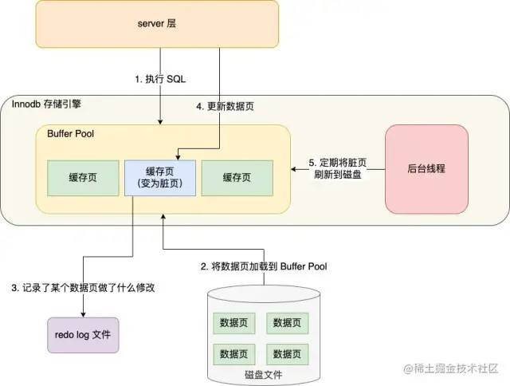
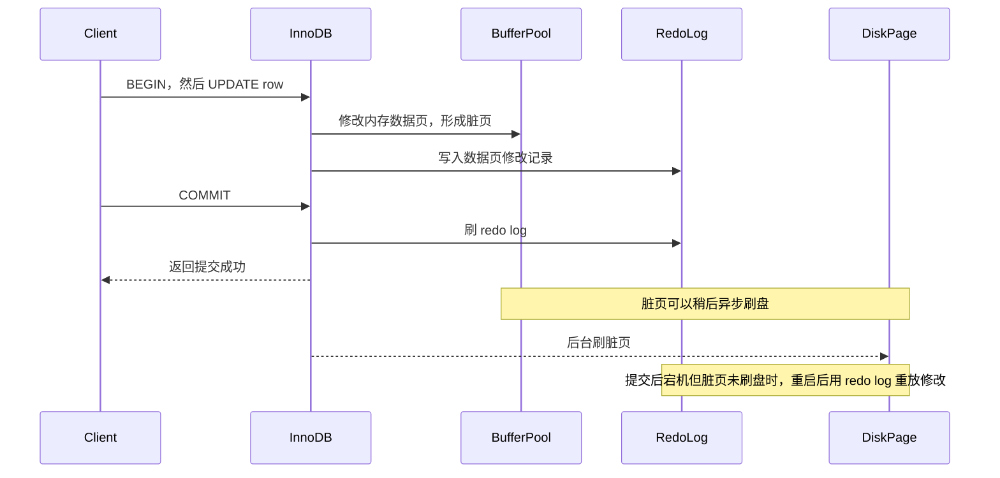
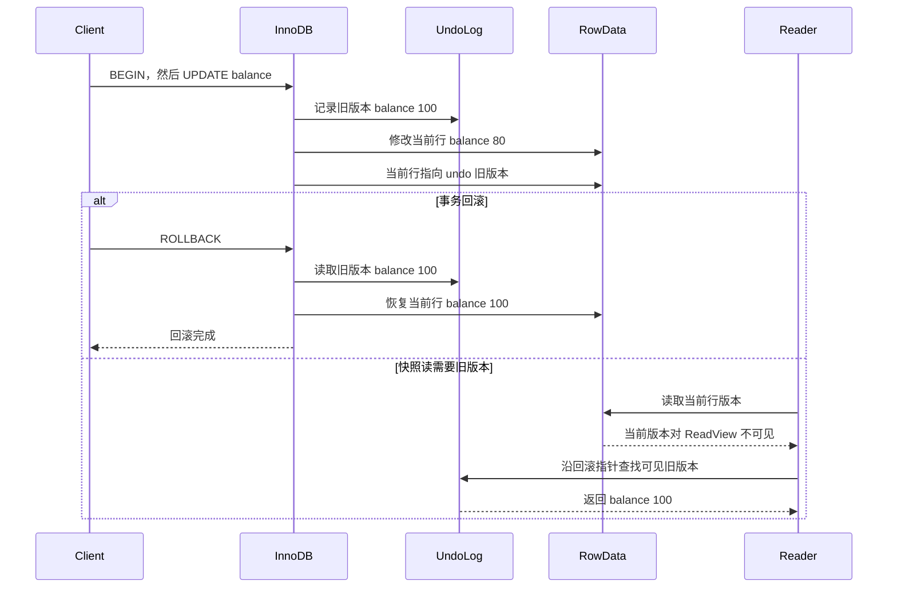

# 事务 ACID、隔离级别

**适用场景：** MySQL 事务基础、隔离级别追问、InnoDB 并发控制、订单/库存/账户类业务一致性面试题。

**回答模板：** 先区分 `redo log` 和 `undo log` 分别解决什么问题；再说事务是把一组 SQL 变成一个逻辑操作单元；然后讲 ACID 分别解决什么问题；接着讲四种隔离级别能避免哪些并发异常；最后结合 InnoDB 默认 `REPEATABLE READ` 和工程选型收尾。

## 目录

- [1. redo log 和 undo log 分别是什么？](#1-redo-log-和-undo-log-分别是什么)
- [2. 事务是什么？](#2-事务是什么)
- [3. ACID 分别是什么？](#3-acid-分别是什么)
- [4. 四种隔离级别是什么？](#4-四种隔离级别是什么)
- [5. 不同隔离级别能解决哪些问题？](#5-不同隔离级别能解决哪些问题)
- [6. InnoDB 默认为什么常用 RR？](#6-innodb-默认为什么常用-rr)
- [7. 面试口述版](#7-面试口述版)
- [8. 高频追问](#8-高频追问)
- [9. 容易踩坑](#9-容易踩坑)
- [10. 自测题](#10-自测题)

---

## 1. redo log 和 undo log 分别是什么？

### 1.1 最简练版

**`redo log` 是重做日志，主要保证事务提交后的持久性；`undo log` 是回滚日志，主要保证事务失败时能回滚，并支持 MVCC 快照读。**

一句话区分：

```text
undo log：记录“修改前的数据旧版本”，回滚时用来撤销修改，快照读时用来找历史版本。
redo log：记录“数据页做了什么修改”，崩溃后用来重放已提交修改。
```

面试里可以直接说：

**
`undo log` 解决事务回滚和历史版本读取问题，对应 ACID 里的原子性，也参与隔离性的 MVCC 实现, 
`redo log` 解决提交后宕机恢复问题，对应 ACID 里的持久性;
**

### 1.2 redo log 是什么？

`redo log` 是 InnoDB 的重做日志。

InnoDB 修改数据时，通常不是每次都立刻把数据页刷回磁盘，而是先修改 Buffer Pool 里的内存页，再把这次修改记录到 `redo log`。这就是 WAL（Write-Ahead Logging，预写日志）思想：**先写日志，再择机刷数据页。**

如果事务已经提交，但数据库还没来得及把脏页刷盘就宕机了，重启后 InnoDB 可以根据 `redo log` 把已提交的修改重新做一遍，从而保证提交后的数据不丢。

可以把它理解为：

```text
事务提交成功
  -> redo log 已记录修改
  -> 数据页可能还没刷盘
  -> 崩溃重启后根据 redo log 恢复
```

示意图：

<div align="center">
  
</div>

时序图：



所以 `redo log` 的核心作用是：

1. 保证事务提交后的持久性。
2. 把随机刷数据页变成更顺序的日志写入，提高写入性能。
3. 支持崩溃恢复，只恢复已经提交或可提交的修改。

### 1.3 undo log 是什么？

`undo log` 是 InnoDB 的回滚日志。

事务修改一行数据前，InnoDB 会先记录这行数据修改前的旧版本。事务执行失败或主动 `rollback` 时，就可以根据 `undo log` 把数据恢复到修改前的状态。

例如：

```text
原余额 = 100
事务把余额改成 80
undo log 记录旧值 100
事务回滚
  -> 根据 undo log 恢复为 100
```

时序图：



`undo log` 除了支持回滚，还支持 MVCC。普通快照读需要读取历史版本时，可以通过行记录里的回滚指针找到对应的 `undo log`，构造出事务可见的旧版本。

所以 `undo log` 的核心作用是：

1. 支持事务回滚，保证原子性。
2. 支持 MVCC 快照读，参与实现隔离性。
3. 保存历史版本，不能在事务提交后立刻全部删除；如果还有旧 ReadView 需要读取历史版本，需要等 purge 线程后续清理。

### 1.4 两者对比

| 对比项 | redo log | undo log |
|---|---|---|
| 中文名 | 重做日志 | 回滚日志 |
| 记录内容 | 数据页的物理修改 | 数据修改前的旧版本 |
| 核心用途 | 崩溃恢复，重放已提交修改 | 事务回滚，构造历史版本 |
| 对应 ACID | 持久性 Durability | 原子性 Atomicity，也参与隔离性 Isolation |
| 典型场景 | 提交后宕机，重启后恢复 | 事务失败回滚、MVCC 快照读 |
| 清理方式 | 循环写，checkpoint 后可覆盖 | 没有旧事务依赖后由 purge 清理 |

最容易混淆的一点是：**`redo log` 不是用来回滚的，`undo log` 也不是用来做崩溃后重放的。**  
`redo log` 面向“提交后怎么恢复”，`undo log` 面向“没提交怎么撤销，以及旧版本怎么读”。

---

## 2. 事务是什么？

### 2.1 最简练版

**事务是一组 SQL 的逻辑执行单元，要么整体成功，要么整体失败。**  
它主要用来保证多步写入在并发和异常场景下仍然满足业务一致性。  
例如扣库存、创建订单、写支付流水，如果中间任一步失败，就不能只留下半成品数据。  
MySQL 里常见的事务能力主要由 InnoDB 提供，MyISAM 不支持事务。

### 2.2 详细解释版

事务解决的问题不是“单条 SQL 能不能执行”，而是“多条 SQL 组合起来是否仍然正确”。

比如下单链路：

```sql
begin;

update sku_stock
set stock = stock - 1
where sku_id = 1001 and stock > 0;

insert into order_tab(order_id, user_id, sku_id, status)
values(90001, 123, 1001, 'created');

insert into order_log(order_id, event)
values(90001, 'create order');

commit;
```

如果扣库存成功，但创建订单失败，系统就会出现“库存少了，订单没了”的错误。事务让这几步成为一个整体，失败时可以回滚。

事务边界通常由下面几个语句控制：

```sql
begin;
commit;
rollback;
```

也可以通过 `set autocommit = 0` 关闭自动提交，但要注意：**`autocommit` 是会话/连接维度的变量，影响的是当前数据库连接，不会影响其他连接。**

例如当前连接执行：

```sql
set autocommit = 0;

update account
set balance = balance - 100
where user_id = 1;

commit;
```

在这个连接上，后续 SQL 默认都不会自动提交，需要显式 `commit` 或 `rollback`。如果想恢复自动提交，需要再执行：

```sql
set autocommit = 1;
```

线上代码里更推荐使用 `begin`、`commit`、`rollback` 或框架提供的事务 API 来表达事务边界，而不是长期依赖 `set autocommit = 0`。原因是应用通常会使用连接池，连接会被复用；如果某段代码关闭了当前连接的自动提交却没有恢复，下一段业务代码拿到同一个连接时，可能会在“非自动提交”的状态下执行，导致事务边界不清晰，甚至出现锁长时间不释放、数据未提交等问题。

例如连接默认保持 `autocommit = 1`，普通单条 SQL 执行完就提交；只有下单、转账这类多步操作，才显式 `begin ... commit`。

---

## 3. ACID 分别是什么？

### 3.1 最简练版

**ACID 是事务正确性的四个维度：原子性、一致性、隔离性、持久性。**  
原子性保证一组操作要么全成功，要么全失败。  
一致性保证事务前后数据满足业务约束。  
隔离性保证并发事务之间互相影响可控。  
持久性保证事务提交后，即使数据库崩溃，数据也尽量不丢。

### 3.2 原子性 Atomicity

原子性强调“不可再分”。

在事务里，多条 SQL 要么全部提交，要么全部回滚。InnoDB 主要通过 `undo log` 支持回滚。事务执行过程中，修改数据前会记录旧版本，如果事务失败，就可以根据 `undo log` 把数据恢复到修改前。

例子：

```text
扣库存成功
写订单失败
  -> rollback
  -> 库存恢复
  -> 不留下半成品状态
```

面试里可以补一句：**原子性不是保证 SQL 不出错，而是出错后能撤销已经完成的部分修改。**

### 3.3 一致性 Consistency

一致性强调“事务前后数据都应该满足约束”。

这里的约束包括两类：

| 约束类型 | 例子 |
|---|---|
| 数据库约束 | 主键唯一、外键、非空、唯一索引 |
| 业务约束 | 库存不能为负、账户余额不能凭空变化、订单状态不能乱跳 |

一致性是目标，A、I、D 是实现这个目标的重要手段，但业务代码也要负责一部分一致性。数据库不能自动知道“支付成功的订单不能回到待支付”，这种状态机约束需要应用层设计。

### 3.4 隔离性 Isolation

隔离性强调“多个事务并发执行时，看起来像某种程度上的串行执行”。

如果没有隔离性，并发事务会出现：

- 脏读：读到别的事务未提交的数据。
- 不可重复读：同一事务内两次读同一行，结果不同。
- 幻读：同一事务内两次按条件查询，结果集合不同。
- 丢失更新：两个事务互相覆盖对方的写入。

InnoDB 通过锁和 MVCC（Multi-Version Concurrency Control，多版本并发控制）共同实现隔离性。

### 3.5 持久性 Durability

持久性强调“提交后的数据不能轻易丢”。

InnoDB 主要通过 `redo log` 保证持久性。事务修改数据时，通常先写日志，再把内存页异步刷盘。即使数据库崩溃，只要事务提交记录已经落到 redo log，重启后就可以重放日志恢复数据。

需要注意：持久性强弱和参数有关，比如：

```text
innodb_flush_log_at_trx_commit = 1
```

通常表示每次事务提交都把 redo log 刷到磁盘，持久性更强，但写入成本更高。

---

## 4. 四种隔离级别是什么？

### 4.1 总览

MySQL 标准隔离级别从低到高是：

| 隔离级别 | 简写 | 特点 |
|---|---|---|
| 读未提交 | RU | 可以读到未提交数据，基本不用 |
| 读已提交 | RC | 每条语句读到执行前已提交的数据 |
| 可重复读 | RR | 同一事务内普通快照读结果稳定 |
| 串行化 | Serializable | 强制更接近串行执行，并发最低 |

InnoDB 默认隔离级别通常是 `REPEATABLE READ`。

查看当前隔离级别：

```sql
select @@transaction_isolation;
```

设置当前会话隔离级别：

```sql
set session transaction isolation level repeatable read;
```

### 4.2 READ UNCOMMITTED

**读未提交允许一个事务读到另一个事务还没有提交的修改。**

问题是可能发生脏读：

事务A更新表t1中的数据并未提交：
```
begin;
update t1 set name='aaa' where id=1;
```

事务B读取表t1中的数据：
```
select * from t1 where id=1;
```

此时，事务B可能会读到 name列值为'aaa' 的行，而在事务A提交之前，name列实际上是没有被更新的。

因此，线上业务几乎不会用这个级别，因为它牺牲了基本正确性。

### 4.3 READ COMMITTED

在读已提交级别下，一个事务只能读取到已经提交的其他事务所修改过的数据。因此，该级别解决了脏读问题。

但是，在该级别下仍然存在**不可重复读**和**幻读**问题。

**不可重复读**是指在同一个事务中，由于其他事务的干扰，导致同一查询语句返回的结果不同。

示例2：

事务A从表t1中读取数据：
```
begin;
select * from t1 where id=1;
```
在A事务还未提交之前，事务B修改了表t1中的数据：

```
begin;
update t1 set name='bbb' where id=1;
commit;
```
此时，当事务A再次执行相同的查询语句时，得到的结果已经不同了。

**幻读**是指在同一个事务中，由于其他事务的干扰，导致同一查询条件下返回的行集合不同。

示例3：

事务A从表t1中读取数据：

```
begin;
select * from t1 where name like '%a%';
```
在A事务还未提交之前，事务B向表t1中插入了一些数据：

```
begin;
insert into t1 (name) values ('abc'), ('def');
commit;
```
此时，当事务A再次执行相同的查询语句时，得到的结果已经不同了。

因此，针对不可重复读和幻读问题，需要使用更高的隔离级别。


**读已提交保证只能读到已经提交的数据。**  即使是另一个事务提交的数据，不是本事务提交的数据。

它能避免脏读，但不能完全避免不可重复读。

```text
事务 A 第一次查询订单：状态 = 待支付
事务 B 把这笔订单更新为已支付并提交
事务 A 第二次查询同一笔订单：状态 = 已支付
```

这在 RC 下是允许的，因为每条语句都会看到语句开始前已经提交的数据。

RC 在很多互联网业务里也常用，优点是语义直观，锁冲突相对少；缺点是同一事务内多次普通读不一定稳定。

### 4.4 REPEATABLE READ 

这是MySQL InnoDB的默认隔离级别

**可重复读保证同一事务内普通快照读看到的结果一致。**

InnoDB 的 RR 通过 MVCC 和 ReadView 实现。普通 `select` 第一次生成 ReadView 后，后续普通 `select` 复用这个视图，所以即使别的事务提交了修改，当前事务仍然看到原来的快照。

```text
事务 A 第一次普通 select：余额 = 100
事务 B 更新余额为 80 并提交
事务 A 第二次普通 select：余额仍然 = 100
```

RR 是 MySQL InnoDB 的常见默认值，也和 binlog 历史上的复制安全、间隙锁行为等有关。

### 4.5 SERIALIZABLE

**串行化隔离级别最严格，并发能力最差。**

它会让事务更接近串行执行，普通读也可能加锁，减少并发异常，但容易带来大量等待和锁冲突。线上高并发业务一般不会轻易使用，除非数据正确性要求极高且并发量可控。

---

## 5. 不同隔离级别能解决哪些问题？

### 5.1 对比表

| 隔离级别 | 脏读 | 不可重复读 | 幻读 | 并发能力 |
|---|---|---|---|---|
| READ UNCOMMITTED | 可能 | 可能 | 可能 | 最高 |
| READ COMMITTED | 避免 | 可能 | 可能 | 高 |
| REPEATABLE READ | 避免 | 避免 | InnoDB 大部分场景可避免 | 中高 |
| SERIALIZABLE | 避免 | 避免 | 避免 | 最低 |

### 5.2 三类异常的区别

| 异常 | 关注点 | 例子 |
|---|---|---|
| 脏读 | 读到未提交数据 | 读到了后来回滚的数据 |
| 不可重复读 | 同一行内容变了 | 同一个订单状态从待支付变成已支付 |
| 幻读 | 查询结果集合变了 | 第二次查询多了一条符合条件的新订单 |

最容易混淆的是不可重复读和幻读。

简单区分：

```text
不可重复读：同一行被改了。
幻读：符合条件的行集合变了。
```

---

## 6. InnoDB 默认为什么常用 RR？

### 6.1 最简练版

**InnoDB 的 RR 在一致性和并发性能之间比较均衡。**  
普通查询通过 MVCC 读快照，不阻塞写；当前读和范围更新通过 next-key lock 控制幻读风险。  
相比 Serializable，它并发更好；相比 RC，它在同一事务内读视图更稳定。  
所以它适合大量 OLTP（Online Transaction Processing，在线事务处理）业务。

### 6.2 详细解释版

InnoDB 的 RR 不是简单靠“所有读都加锁”实现，而是分两类：

| 读类型 | 行为 |
|---|---|
| 快照读 | 普通 `select`，通过 MVCC 读历史版本 |
| 当前读 | `select ... for update`、`update`、`delete`，读最新数据并加锁 |

这样做的好处是：

1. 普通查询不会和写请求强互斥。
2. 同一事务内多次普通查询结果稳定。
3. 范围当前读可以通过 next-key lock 锁住记录和间隙，减少幻读。

所以面试时不要只说“RR 可以避免幻读”，更准确的说法是：

**InnoDB 在 RR 下，普通快照读通过固定 ReadView 避免快照意义上的幻读；当前读通过 next-key lock 在很多范围场景下避免新记录插入造成的幻读。**

---

## 7. 面试口述版

### 7.1 30 秒回答

redo log 是重做日志，用来保证事务提交后崩溃也能恢复；undo log 是回滚日志，用来支持事务回滚，也支持 MVCC 读取历史版本。事务是数据库里一组 SQL 的逻辑执行单元，用 ACID 保证正确性。A 是原子性，靠 undo log 支持回滚；C 是一致性，要求事务前后满足数据库和业务约束；I 是隔离性，靠锁和 MVCC 控制并发影响；D 是持久性，靠 redo log 保证提交后可恢复。MySQL 常见四种隔离级别是 RU、RC、RR、Serializable。InnoDB 默认 RR，因为它通过 MVCC 保证普通读的一致快照，又通过锁机制处理当前读和范围写，在一致性和并发之间比较均衡。

### 7.2 90 秒回答

事务本质上是把多条 SQL 包成一个业务原子操作，比如下单时扣库存、写订单、写流水必须一起成功或一起失败。ACID 里，原子性解决部分成功的问题，InnoDB 通过 undo log 回滚；一致性是目标，要求数据满足约束和业务规则；隔离性解决并发事务互相影响的问题，主要靠锁和 MVCC；持久性解决提交后崩溃恢复的问题，主要靠 redo log。

隔离级别从低到高是读未提交、读已提交、可重复读、串行化。RU 可能脏读，基本不用；RC 避免脏读，但同一事务内两次读可能不同；RR 保证普通快照读在同一事务内稳定，也是 InnoDB 默认；Serializable 最严格但并发最差。实际工程里，如果业务要求读自己刚写的数据或防止并发更新，不能只依赖隔离级别，还要结合主库读、版本号、乐观锁或 `select ... for update`。

---

## 8. 高频追问

### 8.1 ACID 里的一致性是不是完全由数据库保证？

不是。数据库可以保证主键、唯一索引、外键、非空这类结构约束，也可以通过事务、锁和日志机制帮助维持一致性。  
但业务一致性很多时候要靠应用层保证，比如订单状态机、库存不能超卖、账户入账出账平衡。  
所以一致性是目标，不是某一个单独机制。

### 8.2 RC 和 RR 最大区别是什么？

**RC 是每条语句一个新 ReadView，RR 是同一事务内复用 ReadView。**  
所以 RC 下同一事务内两次普通查询可能看到不同结果；RR 下普通快照读通常稳定。

### 8.3 为什么 Serializable 不常用？

因为它会显著降低并发能力。  
在高并发 OLTP 场景，大量读写如果都按强串行化处理，会造成更多锁等待、超时和吞吐下降。  
工程上通常用更精细的方案解决关键一致性问题，比如唯一索引、防重表、乐观锁、行锁、状态机和幂等设计。

### 8.4 隔离级别越高越好吗？

不是。隔离级别越高，一致性语义通常越强，但锁冲突和等待成本也更高。  
选型要看业务是否能接受短暂不一致、读是否必须稳定、写冲突是否频繁、是否有补偿机制。

---

## 9. 容易踩坑

1. 不要把 ACID 背成纯定义，要说清楚 InnoDB 里的落地机制：`undo log`、`redo log`、锁、MVCC。
2. 不要说 RR 在任何情况下都绝对没有幻读，要区分快照读和当前读。
3. 不要把一致性完全甩给数据库，业务状态机和约束设计也很关键。
4. 不要认为开了事务就一定安全，事务边界过大可能造成长事务、锁等待和 undo 堆积。
5. 不要忽略自动提交，MySQL 默认每条 SQL 都是一个独立事务。

---

## 10. 自测题

1. redo log 和 undo log 分别是什么？各自解决什么问题？
2. 事务的 ACID 分别解决什么问题？对应 InnoDB 哪些机制？
3. RC 和 RR 的 ReadView 创建时机有什么不同？
4. 脏读、不可重复读、幻读分别举一个例子。
5. 为什么 Serializable 并发性能差？
6. 如果订单状态更新要求不能被并发覆盖，只靠 RR 够不够？你会怎么设计？
