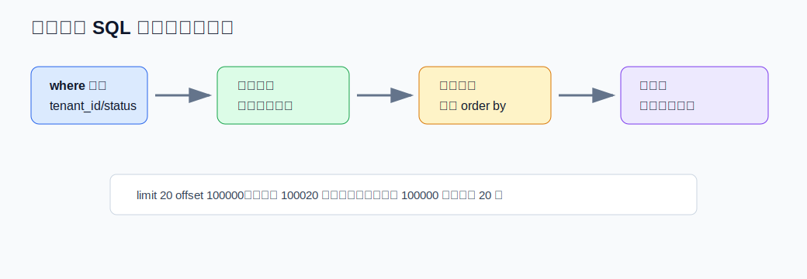
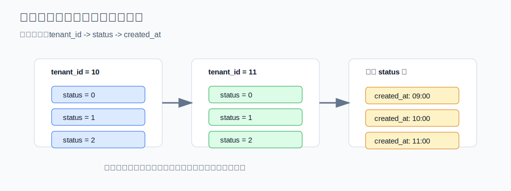
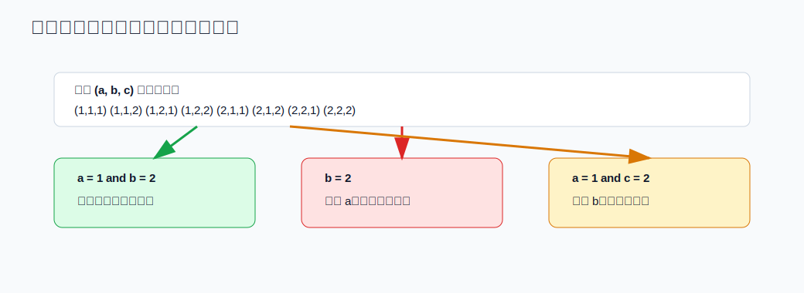
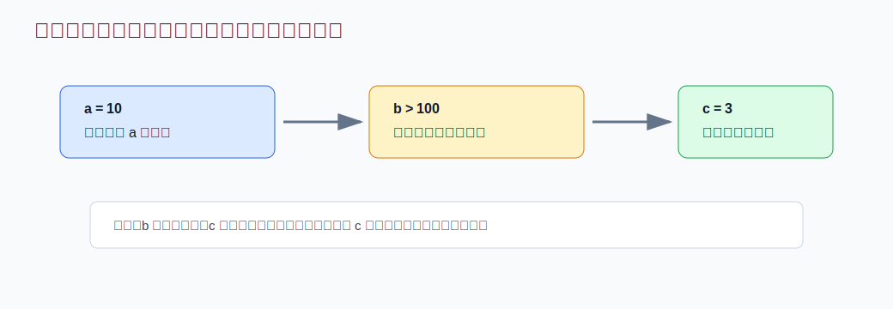
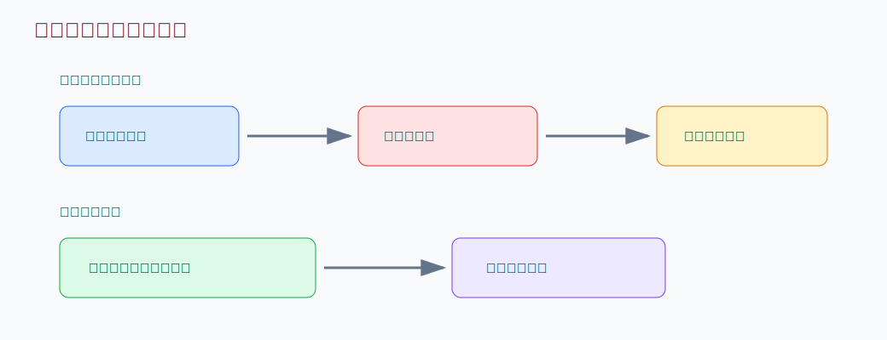
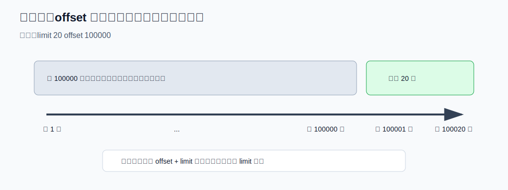
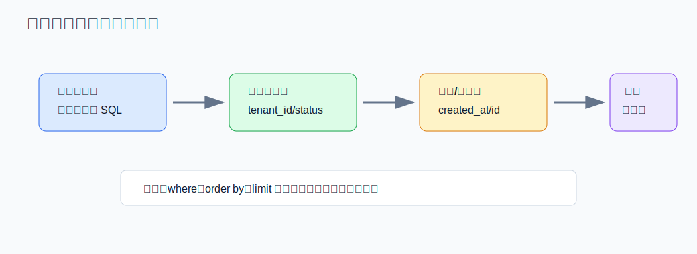
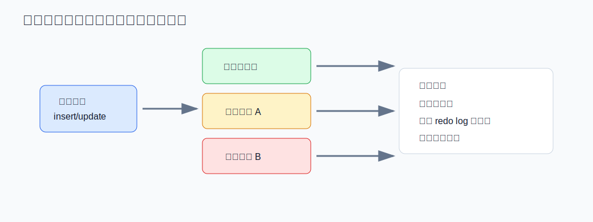
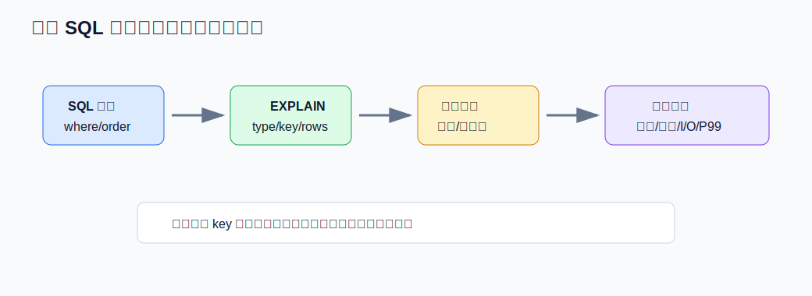

# 联合索引、最左前缀、覆盖索引

**适用场景：** MySQL 索引设计、SQL（Structured Query Language，结构化查询语言）优化、慢查询复盘、列表接口性能优化。  
**核心主线：** 联合索引解决“按什么顺序组织数据”，最左前缀解决“能不能沿着这条顺序定位”，覆盖索引解决“要不要回表取整行”，深分页解决“为什么扫描很多但只返回很少”。

## 目录

- [1. 用一条列表 SQL 串起整体思路（基本难度）](#1-用一条列表-sql-串起整体思路基本难度)
  - [1.1 最简练版](#11-最简练版)
  - [1.2 详细解释版](#12-详细解释版)
  - [1.3 图示](#13-图示)
- [2. 联合索引的本质是什么？（基本难度）](#2-联合索引的本质是什么基本难度)
  - [2.1 最简练版](#21-最简练版)
  - [2.2 详细解释版](#22-详细解释版)
  - [2.3 图示](#23-图示)
- [3. 最左前缀原则怎么理解？（中等难度）](#3-最左前缀原则怎么理解中等难度)
  - [3.1 最简练版](#31-最简练版)
  - [3.2 详细解释版](#32-详细解释版)
  - [3.3 图示](#33-图示)
- [4. 覆盖索引为什么能提升查询性能？（中等难度）](#4-覆盖索引为什么能提升查询性能中等难度)
  - [4.1 最简练版](#41-最简练版)
  - [4.2 详细解释版](#42-详细解释版)
  - [4.3 图示](#43-图示)
- [5. 深分页里 offset 越大，丢弃越多是什么意思？（中等难度）](#5-深分页里-offset-越大丢弃越多是什么意思中等难度)
  - [5.1 最简练版](#51-最简练版)
  - [5.2 详细解释版](#52-详细解释版)
  - [5.3 图示](#53-图示)
- [6. 联合索引列顺序怎么设计？（高难度）](#6-联合索引列顺序怎么设计高难度)
  - [6.1 最简练版](#61-最简练版)
  - [6.2 详细解释版](#62-详细解释版)
  - [6.3 图示](#63-图示)
- [7. 怎么判断一条 SQL 有没有用好索引？（高难度）](#7-怎么判断一条-sql-有没有用好索引高难度)
  - [7.1 最简练版](#71-最简练版)
  - [7.2 详细解释版](#72-详细解释版)
    - [7.2.1 先看 SQL 访问路径](#721-先看-sql-访问路径)
    - [7.2.2 再看 EXPLAIN 关键字段](#722-再看-explain-关键字段)
    - [7.2.3 用返回行数和扫描行数判断性价比](#723-用返回行数和扫描行数判断性价比)
    - [7.2.4 结合 EXPLAIN ANALYZE 看真实执行](#724-结合-explain-analyze-看真实执行)
    - [7.2.5 常见反例和改法](#725-常见反例和改法)
    - [7.2.6 排查时的落地步骤](#726-排查时的落地步骤)
  - [7.3 图示](#73-图示)
- [8. Reference](#8-reference)
- [9. Notes](#9-notes)

---

## 1. 用一条列表 SQL 串起整体思路（基本难度）

### 1.1 最简练版

**联合索引、最左前缀和覆盖索引可以用一条列表查询串起来理解。**  
联合索引把多列拼成一条有序路径，最左前缀决定这条路径能不能从开头连续定位，覆盖索引决定扫描索引后是否还要回表。  
如果再叠加 `limit offset, size`，`offset` 越大，MySQL 为了找到真正要返回的那几行，就越需要先扫描并跳过前面的结果。  
所以索引优化不是只看有没有索引，而是看过滤、排序、返回列和分页方式是否能共用同一条路径。

### 1.2 详细解释版

以订单列表为例：

```sql
select id, title, status, created_at
from order_tab
where tenant_id = ?
  and status = ?
order by created_at desc, id desc
limit 20 offset 100000;
```

如果高频查询就是这个形态，可以考虑：

```sql
create index idx_tenant_status_time_id_title
on order_tab(tenant_id, status, created_at, id, title);
```

这条索引背后有四层含义：

1. **联合索引：** 数据先按 `tenant_id` 排，再按 `status` 排，再按 `created_at` 和 `id` 排。
2. **最左前缀：** 查询从 `tenant_id`、`status` 开始连续命中，能定位到一个更小的有序区间。
3. **覆盖索引：** 查询只返回 `id`、`title`、`status`、`created_at`，这些列都在索引里，可以减少回表。
4. **深分页代价：** `offset 100000` 表示前 100000 条匹配结果不返回，但它们仍然要被扫描到，成本不会消失。

常见误区是只看 `key` 里有没有出现某个索引。更关键的是看扫描范围有多大、是否需要排序、是否需要回表，以及返回第 N 页时前面 N 页的扫描成本有没有被浪费。

### 1.3 图示



这张图对应一条 SQL 的执行思路：先用连续前缀缩小范围，再按索引顺序扫描，最后根据是否覆盖和分页方式决定额外成本。

---

## 2. 联合索引的本质是什么？（基本难度）

### 2.1 最简练版

**联合索引本质上是一棵按“多列组合 key”排序的 B+ 树。**  
比如 `(tenant_id, status, created_at)`，它先比较 `tenant_id`，相同后再比较 `status`，最后比较 `created_at`。  
所以联合索引不是三个单列索引的简单相加，而是一条带顺序的访问路径。  
查询条件和排序条件越贴合这个顺序，扫描范围通常越小。

### 2.2 详细解释版

可以把联合索引理解成一本多级字典：

1. 第一层按 `tenant_id` 分组。
2. 第二层在同一个 `tenant_id` 里按 `status` 分组。
3. 第三层在同一个 `status` 里按 `created_at` 排序。

因此这类 SQL 更容易用好索引：

```sql
select id, title
from order_tab
where tenant_id = 10
  and status = 1
order by created_at desc
limit 20;
```

因为过滤条件和排序条件都沿着 `(tenant_id, status, created_at)` 的顺序走，MySQL 可以先定位到 `tenant_id = 10 and status = 1` 的连续区间，然后按 `created_at` 的索引顺序读取。

容易混淆的一点是：`(a, b, c)` 通常能支持 `a`、`a,b`、`a,b,c` 这类连续前缀，但不能直接等价于 `b` 或 `c` 的单列索引。原因不是 MySQL 不愿意用，而是整棵树的全局顺序不是按 `b` 或 `c` 开始排的。

### 2.3 图示



```text
联合索引：(tenant_id, status, created_at)

tenant_id 相同
  -> status 才形成局部有序
    -> created_at 才形成更小范围内的有序
```

---

## 3. 最左前缀原则怎么理解？（中等难度）

### 3.1 最简练版

**最左前缀原则说的是：联合索引要从最左列开始连续使用，才能稳定形成索引定位区间。**  
如果索引是 `(a, b, c)`，`a`、`a,b`、`a,b,c` 通常可以较好利用索引。  
如果跳过 `a` 只查 `b`，B+ 树整体不是按 `b` 全局排序的，定位能力会明显下降。  
范围条件会让后续列很难继续用于精确定位，但后续列仍可能通过 ICP（Index Condition Pushdown，索引条件下推）在索引内过滤。

### 3.2 详细解释版

以索引 `(a, b, c)` 为例：

| 查询条件 | 主要使用情况 | 关键原因 |
| --- | --- | --- |
| `where a = ?` | **可用** | 命中最左列 |
| `where a = ? and b = ?` | **可用** | 连续命中前两列 |
| `where a = ? and b = ? and c = ?` | **可用** | 连续命中完整前缀 |
| `where a = ? and c = ?` | *主要用 a 定位* | 中间跳过 `b`，连续性中断 |
| `where b = ?` | *通常不适合定位* | 没有从最左列开始 |
| `where a > ? and b = ?` | *a 用范围，b 难做边界* | 范围后区间变宽 |

这里要抓住“有序性”的本质：`(a,b,c)` 的全局顺序首先由 `a` 决定。只有先确定 `a`，`b` 的顺序才有意义；只有先确定 `a,b`，`c` 的顺序才有意义。

范围查询后的列要分两层看：

- **定位边界：** 范围列后面的列通常不能继续精确缩小 B+ 树扫描边界。
- **索引内过滤：** 如果后续列也在索引里，MySQL 可能借助 ICP 在存储引擎层先过滤一部分记录，减少回表。

### 3.3 图示





第二张图强调一个细节：范围列后面的字段不一定完全没用，但它的作用更像“过滤”，不是继续把扫描边界切得很窄。

---

## 4. 覆盖索引为什么能提升查询性能？（中等难度）

### 4.1 最简练版

**覆盖索引是指查询需要的列都能从同一个索引里拿到，不需要再回到聚簇索引取整行。**  
它的主要收益是减少回表，尤其在返回行数多、磁盘随机 I/O（Input/Output，输入输出）多的场景里更明显。  
执行计划里常见标志是 `Extra` 出现 `Using index`。  
但覆盖索引不是越宽越好，列越多，写入成本、存储成本和 Buffer Pool（缓冲池）压力也越大。

### 4.2 详细解释版

假设有索引：

```sql
create index idx_user_status_id
on order_tab(user_id, status, id);
```

下面这条查询就可能形成覆盖索引：

```sql
select id, user_id, status
from order_tab
where user_id = 1001
  and status = 1;
```

因为 `id`、`user_id`、`status` 都在索引里，执行器扫描二级索引就能返回结果。  
如果改成 `select *`，需要读取 `amount`、`address`、`remark` 等不在索引里的列，就要根据二级索引叶子节点中的主键再回到聚簇索引取整行。

覆盖索引适合这些场景：

- 高频列表页只展示少量字段。
- 统计接口只需要状态、时间、数量等字段。
- 深分页先用覆盖索引找主键，再关联回表取详情。

需要注意的是，覆盖索引解决的是读路径上的回表成本，不代表可以无限加列。索引列越多，单个索引页能放下的记录越少，树可能更高，缓存命中率也可能下降。

### 4.3 图示



```text
普通二级索引：
二级索引 -> 找到主键 -> 聚簇索引 -> 取完整行

覆盖索引：
二级索引 -> 直接拿到所需列
```

---

## 5. 深分页里 offset 越大，丢弃越多是什么意思？（中等难度）

### 5.1 最简练版

**`offset` 越大，丢弃越多，意思是 MySQL 为了返回第 N 页，必须先扫描前面 N 页对应的记录，但这些记录不会返回给客户端。**  
比如 `limit 20 offset 100000`，最终只返回 20 条，但执行时通常要先沿着排序结果扫描到第 100020 条。  
前 100000 条只是被跳过，不是免费跳过，它们会消耗索引扫描、过滤、排序甚至回表成本。  
所以深分页越往后越慢，本质是“扫描量随 offset 线性增长”。

### 5.2 详细解释版

很多人会误以为 `offset 100000` 是 MySQL 直接跳到第 100001 条。实际更准确的理解是：

```sql
select id, title
from order_tab
where tenant_id = 10
order by created_at desc
limit 20 offset 100000;
```

MySQL 要先得到符合条件且按 `created_at` 排好序的结果流，然后跳过前 100000 条，再返回后面的 20 条。即使有合适索引，它也通常要扫描 `offset + limit` 条索引记录；如果索引不覆盖，还可能伴随大量回表。

这就是“丢弃”的含义：**不是指数据被删除，也不是指结果已经发给客户端再扔掉，而是指执行器为了定位目标页，读取了很多最终不返回的候选记录。**

优化思路通常有两类：

1. **游标翻页，也叫 keyset pagination。** 用上一页最后一条的排序键作为下一页起点。

```sql
select id, title, created_at
from order_tab
where tenant_id = 10
  and (created_at, id) < (?, ?)
order by created_at desc, id desc
limit 20;
```

2. **延迟关联。** 先用覆盖索引只查主键，再按主键回表取完整字段。

```sql
select o.*
from order_tab o
join (
  select id
  from order_tab
  where tenant_id = 10
  order by created_at desc, id desc
  limit 20 offset 100000
) t on t.id = o.id;
```

如果产品允许“下一页、上一页”这种连续浏览，优先考虑游标翻页；如果必须跳到任意页，至少要用覆盖索引减少扫描阶段的回表成本。

### 5.3 图示



```text
limit 20 offset 100000

扫描结果流： 1 ... 100000 | 100001 ... 100020
处理方式：   跳过          | 返回 20 条
```

---

## 6. 联合索引列顺序怎么设计？（高难度）

### 6.1 最简练版

**联合索引列顺序要围绕真实 SQL 设计，不是简单把区分度最高的列放最前。**  
通常先放稳定等值过滤列，再放范围或排序列，最后为了覆盖索引补少量返回列。  
如果 `where`、`order by`、`limit` 能共用同一条索引路径，收益通常最大。  
同时要控制索引数量和宽度，避免因为维护过多索引而放大写入成本，并减少缓存污染。

### 6.2 详细解释版

设计联合索引时可以按这个顺序判断：

1. **先看高频主路径。** 优先服务核心接口和慢查询，不为低频后台 SQL 牺牲主链路。
2. **再看等值过滤。** `tenant_id`、`user_id`、`status`、`type` 这类等值条件常放在前面。
3. **再看排序和范围。** `created_at between ? and ?`、`order by created_at desc` 这类列要尽量承接扫描顺序。
4. **最后看覆盖。** 只补必要返回列，不把大字段、低频字段塞进索引。

示例：

```sql
where tenant_id = ?
  and status = ?
  and created_at between ? and ?
order by created_at desc
limit 20
```

更自然的索引是：

```sql
create index idx_tenant_status_time
on order_tab(tenant_id, status, created_at);
```

但如果另一个高频 SQL 经常跨租户按时间查全量数据，上面的索引就不一定合适，因为它的全局顺序首先是 `tenant_id`，不是 `created_at`。这时要么单独建服务该查询的索引，要么调整产品查询入口，不能指望一条索引覆盖所有访问模式。

关于写入成本，也可以这样回答：每多一个二级索引，`insert`、`update`、`delete` 除了改聚簇索引，还要维护对应二级索引页，可能产生页分裂、更多 redo log（重做日志）、更多脏页和更高缓存压力。这就是“因为维护索引带来的写入成本放大”。

### 6.3 图示





第一张图看读路径收益，第二张图看写路径代价。读优化和写成本要一起评估。

---

## 7. 怎么判断一条 SQL 有没有用好索引？（高难度）

### 7.1 最简练版

**判断 SQL 有没有用好索引，核心不是“有没有走索引”，而是“是否用很小的扫描代价完成过滤、排序和返回”。**  
回答时可以从 `EXPLAIN` 看 `type`、`key`、`rows`、`filtered`、`Extra`，再对照慢查询里的扫描行数、返回行数和耗时。  
比较理想的情况是：命中符合最左前缀的联合索引，扫描行数接近返回行数，不需要额外排序，不需要大量回表。  
风险信号包括 `type = ALL`、`rows` 很大、`Using filesort`、`Using temporary`、`Using where` 过滤比例很低，以及 `select *` 导致大量回表。  
最后要结合业务基数和真实数据验证，因为优化器基于统计信息做成本估算，执行计划不等于真实耗时。

### 7.2 详细解释版

#### 7.2.1 先看 SQL 访问路径

判断索引质量前，先把 SQL 拆成四个问题：

1. **过滤条件能不能缩小范围。** `where` 是否从联合索引最左列开始连续命中。
2. **排序能不能复用索引顺序。** `order by` 是否接在等值条件后面，方向是否一致。
3. **返回列是否需要回表。** 返回列是否都在索引里，是否可以形成覆盖索引。
4. **分页是否扫描过多。** `limit offset, size` 是否因为 `offset` 很大而扫描并丢弃大量记录。

以订单列表为例：

```sql
select id, title, created_at
from order_tab
where tenant_id = 10
  and status = 1
order by created_at desc, id desc
limit 20;
```

比较合适的索引是：

```sql
create index idx_tenant_status_time_id_title
on order_tab(tenant_id, status, created_at, id, title);
```

原因是 `tenant_id`、`status` 先做等值过滤，`created_at`、`id` 承接排序，`title` 用来覆盖返回列。这个 SQL 的理想执行路径是先定位到一个很小的连续区间，再按索引顺序取前 20 条。

#### 7.2.2 再看 EXPLAIN 关键字段

```sql
explain
select id, title, created_at
from order_tab
where tenant_id = 10
  and status = 1
order by created_at desc, id desc
limit 20;
```

重点字段可以这样解读：

| 字段 | 重点看什么 | 比较理想 | 风险信号 |
| --- | --- | --- | --- |
| `type` | 访问方式 | `const`、`eq_ref`、`ref`、较小范围的 `range` | `ALL`、扫描范围很大的 `range`、低效 `index` 全索引扫描 |
| `possible_keys` | 优化器认为可选的索引 | 有覆盖当前 SQL 的候选索引 | 为空，说明条件基本无法利用现有索引 |
| `key` | 实际选择的索引 | 选择了符合过滤和排序路径的联合索引 | 选了不符合预期的索引，或者为 `NULL` |
| `key_len` | 实际用到的索引长度 | 能反映连续命中了多个前缀列 | 只用到联合索引第一列，后续条件没有参与定位 |
| `rows` | 预估扫描行数 | 接近最终返回行数或业务可接受 | 扫描几十万、几百万，只返回几十条 |
| `filtered` | 存储引擎返回后还能留下多少比例 | 过滤比例和业务预期一致 | 过滤比例很低，说明大量记录被扫出来又丢掉 |
| `Extra` | 额外动作 | `Using index`、合理的 `Using index condition` | `Using filesort`、`Using temporary`、大量 `Using where` |

`type` 大致可以按这个顺序理解，越靠左通常越好，但最终还要看扫描量：

| `type` | 含义 | 典型判断 |
| --- | --- | --- |
| `const` | 主键或唯一索引等值命中一行 | 很好 |
| `eq_ref` | 关联查询中用唯一索引匹配一行 | 很好 |
| `ref` | 普通索引等值匹配多行 | 常见且可接受 |
| `range` | 索引范围扫描 | 看范围大小，范围小就可以 |
| `index` | 扫整棵索引树 | 不一定好，可能只是比扫表薄一点 |
| `ALL` | 全表扫描 | 大表通常是危险信号 |

#### 7.2.3 用返回行数和扫描行数判断性价比

判断索引有没有用好，最直接的口径是：

```text
索引性价比 = 为了返回 N 行，需要扫描多少行、排序多少行、回表多少行
```

例如一个接口只返回 20 条：

| 场景 | 扫描行数 | 返回行数 | 判断 |
| --- | ---: | ---: | --- |
| 命中 `(tenant_id,status,created_at,id)`，扫描 20 到 50 行 | 50 | 20 | **很好**，扫描量和返回量接近 |
| 只命中 `tenant_id`，再过滤 `status`，扫描 200000 行 | 200000 | 20 | *不理想*，说明联合索引顺序不匹配或缺列 |
| 命中索引但 `order by` 不能复用，排序 200000 行后取 20 行 | 200000 | 20 | *不理想*，额外排序成本高 |
| `select *` 返回 20 行，但扫描并回表 100000 行 | 100000 | 20 | *不理想*，回表放大随机 I/O |

线上排查时还要看慢查询日志里的 `Rows_examined` 和 `Rows_sent`。如果 `Rows_examined` 远大于 `Rows_sent`，通常说明扫描了大量最终没有返回的候选记录。

```text
Rows_examined = 200000
Rows_sent     = 20

含义：为了返回 20 行，实际检查了 20 万行，索引路径大概率不够贴合。
```

#### 7.2.4 结合 EXPLAIN ANALYZE 看真实执行

MySQL 8.0 可以用 `EXPLAIN ANALYZE` 看真实执行耗时和真实行数。`EXPLAIN` 是优化器估算，`EXPLAIN ANALYZE` 会真正执行 SQL，因此更适合在测试环境或可控场景验证。

```sql
explain analyze
select id, title, created_at
from order_tab
where tenant_id = 10
  and status = 1
order by created_at desc, id desc
limit 20;
```

重点看三件事：

1. **estimated rows 和 actual rows 差距。** 差距很大可能是统计信息不准、数据倾斜或条件相关性强。
2. **actual time 消耗在哪一层。** 如果排序、临时表、回表节点耗时高，就要针对那一层优化。
3. **loops 次数。** 关联查询里某个内层表如果循环几十万次，很容易把小问题放大成大延迟。

如果估算和真实偏差明显，可以考虑更新统计信息：

```sql
analyze table order_tab;
```

但要注意，更新统计信息只能帮助优化器做更准的选择，不能替代合理索引设计。

#### 7.2.5 常见反例和改法

**例 1：只建了单列索引，过滤和排序无法共用路径。**

```sql
create index idx_tenant on order_tab(tenant_id);
create index idx_created_at on order_tab(created_at);

select id, title, created_at
from order_tab
where tenant_id = 10
  and status = 1
order by created_at desc
limit 20;
```

风险点是 MySQL 可能用 `idx_tenant` 找出租户下大量记录，再过滤 `status`，最后对结果做 `Using filesort`。如果租户数据很多，虽然 `key = idx_tenant`，也不能说索引用好了。

更贴合的索引：

```sql
create index idx_tenant_status_time
on order_tab(tenant_id, status, created_at);
```

优化后的目标是：`tenant_id`、`status` 缩小范围，`created_at` 复用索引顺序，减少排序。

**例 2：跳过联合索引最左列。**

```sql
create index idx_tenant_status_time
on order_tab(tenant_id, status, created_at);

select id, title
from order_tab
where status = 1
order by created_at desc
limit 20;
```

这条 SQL 没有 `tenant_id`，不能稳定利用 `(tenant_id,status,created_at)` 的全局有序性。即使 `status` 在索引里，也不是这棵 B+ 树的第一排序维度。

常见改法有两种：

```sql
-- 如果跨租户按状态查是高频路径，单独建匹配索引
create index idx_status_time
on order_tab(status, created_at);

-- 如果业务上必须按租户隔离查询，就补上租户条件
where tenant_id = ?
  and status = ?
```

**例 3：范围条件后面的列不能继续缩小定位边界。**

```sql
create index idx_tenant_time_status
on order_tab(tenant_id, created_at, status);

select id, title
from order_tab
where tenant_id = 10
  and created_at >= '2026-05-01'
  and status = 1
order by created_at desc
limit 20;
```

`tenant_id` 可以等值定位，`created_at` 是范围条件，后面的 `status` 通常更像索引内过滤，难以继续把扫描边界切得很窄。如果 `status = 1` 的选择性很好，并且这是核心查询，更合适的索引可能是：

```sql
create index idx_tenant_status_time
on order_tab(tenant_id, status, created_at);
```

这样先用 `tenant_id`、`status` 缩小范围，再扫时间区间。

**例 4：`order by` 和索引顺序不一致导致额外排序。**

```sql
create index idx_tenant_status_time_id
on order_tab(tenant_id, status, created_at, id);

select id, title, created_at
from order_tab
where tenant_id = 10
  and status = 1
order by id desc
limit 20;
```

索引在 `tenant_id,status` 后面的顺序是 `created_at,id`，不是单独按 `id` 排。这个查询可能仍然要 `Using filesort`。如果高频需求就是按 `id desc` 翻页，可以考虑：

```sql
create index idx_tenant_status_id
on order_tab(tenant_id, status, id);
```

如果既有按时间排序，又有按 id 排序，就要按访问频率、数据量和写入成本决定是否保留两条索引。

**例 5：函数或隐式类型转换让索引失效。**

```sql
-- created_at 上有索引，但对列做函数计算
select id
from order_tab
where date(created_at) = '2026-05-06';

-- user_id 是 bigint，但传入字符串，可能触发隐式转换
select id
from order_tab
where user_id = '10001';
```

更推荐把计算放到常量侧，或者保证参数类型和字段类型一致：

```sql
select id
from order_tab
where created_at >= '2026-05-06 00:00:00'
  and created_at <  '2026-05-07 00:00:00';

select id
from order_tab
where user_id = 10001;
```

**例 6：`select *` 让本来可以覆盖的索引变成大量回表。**

```sql
create index idx_tenant_status_time_title
on order_tab(tenant_id, status, created_at, title);

select *
from order_tab
where tenant_id = 10
  and status = 1
order by created_at desc
limit 1000;
```

如果业务只需要列表字段，就不要取整行：

```sql
select id, title, status, created_at
from order_tab
where tenant_id = 10
  and status = 1
order by created_at desc
limit 1000;
```

目标是让 `Extra` 出现 `Using index`，减少二级索引到聚簇索引的回表。

**例 7：低选择性索引不一定值得用。**

```sql
create index idx_status on order_tab(status);

select id, title
from order_tab
where status = 1;
```

如果 `status = 1` 覆盖全表 80% 的数据，走 `idx_status` 可能要扫描大量二级索引并频繁回表，成本不一定低于全表扫描。优化器可能选择 `ALL`，这不一定是错误，而是因为这个索引选择性太差。

更好的做法通常是把低选择性列放在更有区分度、且符合查询路径的前缀后面：

```sql
create index idx_tenant_status_time
on order_tab(tenant_id, status, created_at);
```

#### 7.2.6 排查时的落地步骤

可以按这个顺序说清楚：

1. **看 SQL：** 先拆 `where`、`order by`、`limit`、返回列，判断它们能不能共用同一个联合索引。
2. **看计划：** 用 `EXPLAIN` 看 `type`、`key`、`key_len`、`rows`、`filtered`、`Extra`。
3. **看比例：** 对比 `Rows_examined` 和 `Rows_sent`，判断是否为了返回少量数据扫描了大量记录。
4. **看额外成本：** 如果有 `Using filesort`、`Using temporary`、大量回表，就继续拆排序、分组和返回列。
5. **看真实执行：** 在可控环境用 `EXPLAIN ANALYZE` 对比估算行数和真实行数。
6. **做小步验证：** 调整联合索引列顺序、增加覆盖列、改写范围条件、改深分页方式，每次只验证一个变量。

线上指标可以重点看 CPU（Central Processing Unit，中央处理器）、Buffer Pool、磁盘 I/O、P95（95th percentile，第 95 百分位延迟）和 P99（99th percentile，第 99 百分位延迟）。如果改完索引后平均耗时下降，但 P99 仍然尖刺明显，就要继续看是否有锁等待、冷热数据切换、磁盘抖动或大查询抢资源。

一个比较完整的结论可以这样组织：

```text
这条 SQL 虽然 key 命中了 idx_tenant，但 rows 预估有 20 万，Extra 还有 Using filesort。
说明它只是用 tenant_id 找到了一个大范围，status 过滤和 created_at 排序没有和索引共用同一条路径。
我会把索引调整为 (tenant_id, status, created_at, id)，让等值过滤在前，排序字段接在后面。
如果列表只返回 id、title、created_at，再补 title 做覆盖，减少回表。
```

### 7.3 图示



```text
SQL 形态
  |
  v
EXPLAIN 执行计划
  |
  +--> type/key/key_len：有没有沿最左前缀定位
  |
  +--> rows/filtered：扫描量和过滤比例是否合理
  |
  +--> Extra：是否 filesort、temporary、回表过多
  |
  v
慢查询与真实执行
  |
  +--> Rows_examined / Rows_sent
  +--> P95/P99 延迟
  +--> CPU、Buffer Pool、磁盘 I/O
  |
  v
调整索引列顺序 / 覆盖索引 / 改写 SQL / 改分页方式
```

```text
理想路径：

where 等值条件      order by       select 返回列
tenant_id,status -> created_at,id -> id,title,created_at
      |                 |                 |
      v                 v                 v
  缩小扫描范围      复用索引顺序        尽量覆盖，减少回表
```

```text
不理想路径：

key 命中 idx_tenant
      |
      v
扫描租户下 200000 行
      |
      v
过滤 status，只剩 5000 行
      |
      v
Using filesort 排序
      |
      v
返回 limit 20
```

---

## 8. Reference

## 9. Notes
