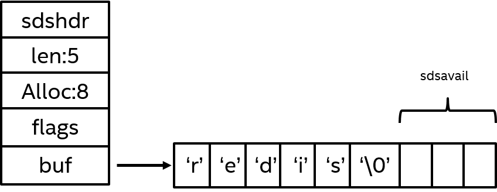

# Redis 基础数据结构与命令 20 题

**适用场景：** Redis 基础原理、数据结构、常用命令、单线程模型、过期删除、事务和 Lua 脚本集中复习。  
**回答主线：** 先讲 Redis 是什么和为什么快，再串起 **数据类型、底层编码、时间复杂度、命令风险、原子性和工程使用边界**。

## 目录

- [1. Redis 是什么，适合解决什么问题？（基本难度）](#1-redis-是什么适合解决什么问题基本难度)
- [2. Redis 为什么快？（基本难度）](#2-redis-为什么快基本难度)
- [3. Redis 单线程指的是什么？（中等难度）](#3-redis-单线程指的是什么中等难度)
- [4. Redis 常见数据类型有哪些？（基本难度）](#4-redis-常见数据类型有哪些基本难度)
- [5. String 底层是怎么实现的？（中等难度）](#5-string-底层是怎么实现的中等难度)
- [6. Hash 适合什么场景？（基本难度）](#6-hash-适合什么场景基本难度)
- [7. List、Set、ZSet 的典型使用场景是什么？（基本难度）](#7-listsetzset-的典型使用场景是什么基本难度)
- [8. ZSet 为什么既能排序又能快速查找？（中等难度）](#8-zset-为什么既能排序又能快速查找中等难度)
- [9. Bitmap、HyperLogLog、Geo 分别解决什么问题？（中等难度）](#9-bitmaphyperlogloggeo-分别解决什么问题中等难度)
- [10. Redis key 设计要注意什么？（基本难度）](#10-redis-key-设计要注意什么基本难度)
- [11. 过期时间是怎么工作的？（中等难度）](#11-过期时间是怎么工作的中等难度)
- [12. Redis 删除过期 key 的策略是什么？（中等难度）](#12-redis-删除过期-key-的策略是什么中等难度)
- [13. keys 和 scan 有什么区别？（中等难度）](#13-keys-和-scan-有什么区别中等难度)
- [14. Redis 事务有什么特点？（中等难度）](#14-redis-事务有什么特点中等难度)
- [15. Lua 脚本为什么能保证原子性？（中等难度）](#15-lua-脚本为什么能保证原子性中等难度)
- [16. Pipeline 解决什么问题？（中等难度）](#16-pipeline-解决什么问题中等难度)
- [17. multi、Pipeline、Lua 有什么区别？（中等难度）](#17-multipelinelua-有什么区别中等难度)
- [18. Redis 的发布订阅有什么局限？（基本难度）](#18-redis-的发布订阅有什么局限基本难度)
- [19. Stream 适合替代消息队列吗？（高难度）](#19-stream-适合替代消息队列吗高难度)
- [20. 慢命令通常来自哪里？（中等难度）](#20-慢命令通常来自哪里中等难度)
- [21. Reference](#21-reference)
- [22. Notes](#22-notes)

---

## 1. Redis 是什么，适合解决什么问题？（基本难度）

### 1.1 最简练版

Redis 是基于内存的高性能键值数据库，常用于缓存、计数、排行榜、分布式锁、限流和轻量消息场景。 
它的优势是读写快、数据结构丰富、命令原子、生态成熟。  
但它不是关系型数据库的替代品，不能把复杂事务、强一致关系建模和大规模离线查询都压到 Redis 上。

### 1.2 详细解释版

Redis 适合处理高频、低延迟、结构相对简单的数据访问。比如商品详情缓存、用户状态缓存、验证码、库存扣减前置校验、热榜、延迟不高的事件流。  
工程上要先判断数据是否允许短暂不一致、是否能重建、容量是否可控、故障时是否能降级。把 Redis 当缓存时，核心是降低数据库压力；当存储用时，要重点评估持久化、高可用、备份恢复和内存成本。

### 1.3 例子

```text
用户请求 -> Redis 命中 -> 返回
       -> Redis 未命中 -> 查数据库 -> 回填 Redis -> 返回
```

---

## 2. Redis 为什么快？（基本难度）

### 2.1 最简练版

**1 数据在内存中
2 核心命令用高效数据结构实现，常见操作是 O(1) 或 O(logN)。
3 网络事件处理模型简单
4 并且避免了大量线程切换成本。**  

但 Redis 快不代表所有命令都快，下面命令可能拖慢服务
* `keys`
* 大 key 删除
* 全量范围查询

### 2.2 详细解释版

Redis 的快来自几个层面：内存访问比磁盘快很多；字符串、哈希表、跳表、压缩列表等结构针对常见操作优化；单线程执行命令天然避免锁竞争；I/O（Input/Output，输入输出）多路复用能高效处理大量连接。  
高版本 Redis 还引入 I/O 线程处理网络读写，但命令执行主路径仍强调串行一致性。真正线上优化时，要看命令复杂度、value 大小、网络往返、持久化配置和主从同步压力。

### 2.3 例子

| 因素 | 收益 | 风险 |
|---|---|---|
| 内存读写 | 延迟低 | 容量成本高 |
| 单线程命令执行 | 无锁竞争 | 慢命令会阻塞后续命令 |
| 高效结构 | 常见操作快 | 用错命令仍会慢 |

---

## 3. Redis 单线程指的是什么？（中等难度）

### 3.1 最简练版

**Redis 单线程通常指命令执行主流程是单线程串行的，不是整个进程只有一个线程。**  
后台持久化、异步删除、网络 I/O 等可能使用额外线程或子进程。  
串行执行让命令天然具备单命令原子性，但慢命令会阻塞后续请求。

### 3.2 详细解释版

Redis 用事件循环处理客户端连接和命令执行。一个命令执行过程中，不会被另一个命令穿插修改同一份数据，所以 `incr`、`hset` 等单命令天然原子。  
但单线程也意味着不要执行大范围扫描、大 key 聚合、复杂 Lua 和大对象同步删除。实际调优要结合 `SLOWLOG GET`、`latency doctor`、`INFO commandstats` 找到阻塞点。

### 3.3 图示

```text
连接事件 -> 读取命令 -> 执行命令 -> 写回响应
                |
                v
          慢命令会卡住队列
```

---

## 4. Redis 常见数据类型有哪些？（基本难度）

### 4.1 最简练版

**Redis 常用类型有 String、Hash、List、Set、Sorted Set、Bitmap、HyperLogLog、Geo 和 Stream。**  
String 适合简单 KV 和计数，Hash 适合对象字段，List 适合队列，Set 适合去重集合，Sorted Set 适合排行榜。  
选类型时看访问模式，而不是只看数据长什么样。

### 4.2 详细解释版

不同类型背后的命令复杂度和内存开销不同。比如用户对象可以用一个 JSON String，也可以用 Hash；前者整体读写简单，后者字段级更新方便。排行榜用 ZSet 是因为天然按 score 排序，去重用 Set 是因为成员唯一。  
设计时要提前想清楚：是否按字段更新、是否需要排序、是否需要范围查询、是否要统计基数、是否存在超大 value。

### 4.3 例子

| 类型 | 场景 |
|---|---|
| String | token、验证码、计数器 |
| Hash | 用户资料、商品局部字段 |
| Set | 关注集合、抽奖去重 |
| ZSet | 热榜、积分榜 |
| Stream | 轻量事件流 |

---

## 5. String 底层是怎么实现的？（中等难度）

### 5.1 最简练版

**Redis String 底层主要使用 SDS（Simple Dynamic String，简单动态字符串）。**



SDS 不是普通 C 字符串，它在字符数组外额外记录 `len` 和 `free`，所以可以 O(1) 获取长度，并通过预分配空间减少追加字符串时的内存重分配。  
String 对象保存字符串值时通常依赖 SDS；如果值是小整数，也可能直接使用整数编码；短字符串和长字符串还会分别使用 `embstr`、`raw` 等对象编码优化内存分配。

### 5.2 详细解释版

Redis 没有直接用 C 语言的 `char*` 表示字符串，核心原因是 C 字符串在长度计算、追加和二进制安全上都不适合 Redis 的高频读写场景。C 字符串计算长度需要从头扫描到 `\0`，复杂度是 O(N)；每次追加如果空间不够，就可能触发重新分配；并且默认把 `\0` 当作字符串结束标记，不适合保存任意字节数据。

SDS 的经典结构可以理解为：

```c
typedef char *sds;

struct sdshdr {
    int len;   // buf 已使用长度
    int free;  // buf 剩余可用长度
    char buf[]; // 实际保存数据，末尾仍保留 '\0'
};
```

其中 `len` 让 `STRLEN` 这类长度查询可以 O(1) 完成；`free` 记录预留空间，让 `APPEND` 这类追加操作在剩余空间足够时不需要重新分配内存；`buf` 保存真实内容，并且 SDS 根据 `len` 判断数据长度，所以即使内容中包含 `\0` 也可以正常保存，具备二进制安全能力。

SDS 对追加操作还有空间预分配策略：如果扩容后的字符串小于 1MB，通常会分配约两倍所需空间；如果大于等于 1MB，通常额外多分配 1MB。这样做的好处是降低连续追加时的内存分配次数，代价是会多占一部分内存。被追加后产生的预分配空间通常不会立刻主动释放，除非删除 key、重启后重新载入，或者显式触发类似释放空闲空间的内部处理。

面试里还要区分两个层次：

| 层次 | 说明 |
|---|---|
| SDS | Redis 内部字符串表示，解决长度、追加、二进制安全问题 |
| String 对象编码 | Redis 对象层优化，常见有 `int`、`embstr`、`raw` |

所以回答时不要只说“String 就是 SDS”。更准确的说法是：**Redis String 对象在保存普通字符串时底层使用 SDS，但对象本身还会根据值的大小和形态选择不同 encoding。**

### 5.3 例子

观察对象编码：

```bash
OBJECT ENCODING counter
OBJECT ENCODING user:name
```

用 `OBJECT ENCODING` 可以观察 key 的内部编码，但线上不要对大批量 key 直接执行探测。

追加字符串时，SDS 会优先使用已有 `free` 空间：

```bash
SET msg "hello world"
APPEND msg " again!"
STRLEN msg
```

`STRLEN` 不需要像 C 字符串那样扫描完整内容，Redis 可以通过 SDS 中记录的长度直接返回结果。

---

## 6. Hash 适合什么场景？（基本难度）

### 6.1 最简练版

**Hash 适合存储字段较多、需要局部读写的对象。**  
例如用户资料、商品扩展属性、风控特征。  
如果每次都整体读写，String JSON 可能更简单；如果字段级更新频繁，Hash 更合适。

### 6.2 详细解释版

Hash 可以用 `hget`、`hmget`、`hset` 更新单个字段，避免整个对象反序列化和覆盖。  
但 Hash 也要控制字段数和 value 大小，避免一个 key 变成大 key。对象结构很复杂、需要版本化或强一致校验时，不应只依赖 Redis Hash。

### 6.3 例子

```bash
hset user:1001 name zhangsan level 5 city shenzhen
hget user:1001 level
hincrby user:1001 level 1
```

---

## 7. List、Set、ZSet 的典型使用场景是什么？（基本难度）

### 7.1 最简练版

**List 适合按插入顺序处理，Set 适合去重和集合运算，ZSet 适合带分数排序。**  
List 常用于简单队列，Set 常用于关注关系、去重名单，ZSet 常用于排行榜和延迟任务候选集。  
选择时重点看是否需要顺序、唯一性、分数排序。

### 7.2 详细解释版

List 的两端操作快，但中间范围过大或按值删除成本高。Set 成员唯一，适合交并差，但大集合运算可能阻塞。ZSet 通过 score 排序，支持范围查询，但写入和维护排序比普通 Set 更贵。  
线上使用时要避免一次取超大范围，优先分页、小批量处理。

### 7.3 例子

| 类型 | 关键命令 | 适合场景 |
|---|---|---|
| List | `lpush`、`brpop` | 简单队列 |
| Set | `sadd`、`sismember` | 去重、标签 |
| ZSet | `zadd`、`zrevrange` | 排行榜、热度榜 |

---

## 8. ZSet 为什么既能排序又能快速查找？（中等难度）

### 8.1 最简练版

**ZSet 通常由哈希表和跳表组合实现。**  
哈希表让 member 到 score 的查询接近 O(1)，跳表让按 score 排序、范围查询和排名计算保持较高效率。  
所以 ZSet 同时支持快速查成员和按分数有序访问。

### 8.2 详细解释版

哈希表解决“这个成员是否存在、分数是多少”的问题，跳表解决“按分数从小到大排列、取某个范围”的问题。  
跳表比平衡树实现更简单，范围扫描友好，平均复杂度 O(logN)。当元素很少、成员较小时，Redis 可能使用 listpack 这类紧凑编码节省内存。

### 8.3 图示

```text
member -> score 由 hash 快速定位

score 有序链路：
10 -> 18 -> 20 -> 35 -> 99
```

---

## 9. Bitmap、HyperLogLog、Geo 分别解决什么问题？（中等难度）

### 9.1 最简练版

**Bitmap 适合按位标记，HyperLogLog 适合近似去重计数，Geo 适合地理位置距离和范围查询。**  
Bitmap 常用于签到、活跃状态；HyperLogLog 常用于 UV（Unique Visitor，独立访客）估算；Geo 常用于附近门店。  
它们都是用更低成本解决特定统计问题。

### 9.2 详细解释版

Bitmap 本质是在 String 上做位操作，空间效率高，但 offset 过大会拉大字符串。HyperLogLog 牺牲精确度换低内存，适合趋势统计，不适合精确结算。Geo 基于经纬度编码，适合粗粒度附近查询，复杂地理围栏仍需要专业空间索引系统。

### 9.3 例子

```bash
setbit sign:2026-07 user_id 1
pfadd uv:home user_a user_b
geoadd shop:geo 114.0579 22.5431 shop_1
```

---

## 10. Redis key 设计要注意什么？（基本难度）

### 10.1 最简练版

**key 设计要可读、可定位、长度适中，并体现业务边界。**  
常见格式是 `业务:对象:标识:维度`。  
不要把 key 写得过长，也不要缺少命名空间，否则排查和清理都会困难。

### 10.2 详细解释版

好的 key 能帮助定位问题、做批量迁移和按业务统计。比如 `user:profile:1001` 比 `u1001` 更容易维护。  
需要注意 key 的数量、TTL（Time To Live，生存时间）策略、热点分布和敏感信息。不要把手机号、身份证等敏感字段直接裸写到 key 里。

### 10.3 例子

```text
推荐：mall:sku:detail:12345
谨慎：12345
谨慎：mall:sku:detail:region:city:channel:device:language:12345
```

---

## 11. 过期时间是怎么工作的？（中等难度）

### 11.1 最简练版

**Redis 会为设置过期的 key 维护过期字典，记录 key 到期时间。**  
访问 key 时会判断是否过期，后台也会周期性抽样清理。  
过期不是到点必然立刻删除，而是在惰性删除和定期删除中逐步完成。

### 11.2 详细解释版

过期时间独立于主数据字典保存。惰性删除是在访问 key 时发现过期再删除；定期删除是 Redis 周期性抽样检查一批过期 key。  
这种设计避免每个 key 到期都创建定时器，降低调度成本。但如果大量 key 同一时间过期，可能造成 CPU（Central Processing Unit，中央处理器）抖动、缓存雪崩或内存短期未释放。

### 11.3 例子

```bash
set user:token:1001 abc ex 3600
ttl user:token:1001
```

---

## 12. Redis 删除过期 key 的策略是什么？（中等难度）

### 12.1 最简练版

**Redis 过期删除主要是惰性删除加定期删除。**  
惰性删除节省后台扫描成本，但过期 key 可能暂时占内存。  
定期删除主动清理一部分过期 key，但不能无限扫描，否则会影响请求处理。

### 12.2 详细解释版

惰性删除适合“访问时顺手清理”，定期删除适合“后台抽样推进”。二者结合是在 CPU 成本和内存释放之间做平衡。  
如果过期 key 太多，且访问不均匀，内存可能上涨；如果同一秒大量过期，定期删除可能带来延迟尖刺。工程上常给 TTL 加随机抖动。

### 12.3 例子

```text
原始 TTL：3600 秒
优化 TTL：3600 + random(0, 300) 秒
```

---

## 13. keys 和 scan 有什么区别？（中等难度）

### 13.1 最简练版

**`keys` 会一次性遍历匹配所有 key，可能阻塞 Redis；`scan` 是游标式渐进遍历，对线上更友好。**  
`scan` 不保证一次返回全部，也可能返回重复，需要客户端去重或容忍重复。  
生产环境排查一般优先用 `scan`，并控制每批数量。

### 13.2 详细解释版

`keys pattern` 的复杂度是 O(N)，N 是 key 总数，key 很多时会让后续命令排队。`scan cursor match pattern count n` 每次只扫描一小段，适合增量处理。  
但 `scan` 不是强一致快照，遍历期间新增删除 key 会影响结果，因此适合运维扫描、迁移辅助，不适合严格业务逻辑。

### 13.3 例子

```bash
scan 0 match mall:sku:* count 1000
```

---

## 14. Redis 事务有什么特点？（中等难度）

### 14.1 最简练版

**Redis 事务通过 `multi`、`exec` 把一批命令按顺序执行，但不支持传统数据库那种回滚。**  
入队阶段命令语法错误会影响执行，运行阶段某条命令失败不会自动回滚前面命令。  
需要乐观锁时可以配合 `watch` 监控 key 是否被修改。

### 14.2 详细解释版

Redis 事务强调“批量顺序执行”和“执行期间不被其他命令插入”，不提供 ACID（Atomicity、Consistency、Isolation、Durability，原子性、一致性、隔离性、持久性）里的完整回滚语义。  
如果业务需要复杂条件判断和原子修改，Lua 通常比 `multi` 更合适。`watch` 是 CAS（Compare And Swap，比较并交换）式乐观锁，适合冲突不高的场景。

### 14.3 例子

```bash
watch stock:sku:1
multi
decr stock:sku:1
incr order:count
exec
```

---

## 15. Lua 脚本为什么能保证原子性？（中等难度）

### 15.1 最简练版

**Lua 脚本在 Redis 中作为一个整体执行，执行期间不会穿插其他命令，所以能保证脚本内逻辑原子。**  
它适合“先判断再修改”的场景，比如扣库存、限流、释放锁。  
但脚本不能太慢，也不要做大范围扫描，否则会阻塞 Redis。

### 15.2 详细解释版

Redis 的命令执行串行化使 Lua 脚本天然具备原子性。相比客户端多次请求，Lua 把读、判断、写放到服务端一次完成，避免竞态条件和网络往返。  
注意脚本要可控、可终止，避免使用不确定的随机和时间逻辑影响主从复制一致性。集群模式下 Lua 脚本涉及的 key 通常要落在同一个 slot。

### 15.3 例子

```lua
if redis.call('get', KEYS[1]) == ARGV[1] then
  return redis.call('del', KEYS[1])
end
return 0
```

---

## 16. Pipeline 解决什么问题？（中等难度）

### 16.1 最简练版

**Pipeline 解决的是多条命令多次网络往返导致的延迟问题。**  
客户端一次发送多条命令，Redis 依次执行后批量返回结果。  
它提升吞吐，但不保证一组命令的原子性。

### 16.2 详细解释版

如果每条命令都等待响应，RTT（Round-Trip Time，往返时延）会成为瓶颈。Pipeline 把多条命令合并发送，减少等待次数，适合批量读取、批量写入、预热缓存。  
批量大小要控制，过大会占用客户端和服务端缓冲区，造成延迟波动。

### 16.3 图示

```text
普通模式：cmd1 -> resp1 -> cmd2 -> resp2
Pipeline：cmd1, cmd2, cmd3 -> resp1, resp2, resp3
```

---

## 17. multi、Pipeline、Lua 有什么区别？（中等难度）

### 17.1 最简练版

**Pipeline 减少网络往返，multi 保证批量顺序执行，Lua 保证服务端条件逻辑原子执行。**  
Pipeline 不保证原子性；multi 不擅长复杂判断；Lua 适合把判断和修改合在一起。  
选择时看目标是吞吐、顺序还是原子条件更新。

### 17.2 详细解释版

| 机制 | 主要目标 | 原子性 | 典型场景 |
|---|---|---|---|
| Pipeline | 减少 RTT | 不保证整体原子 | 批量读写 |
| multi/exec | 顺序批量执行 | 执行期间不插队 | 简单批处理 |
| Lua | 条件逻辑原子化 | 脚本整体原子 | 限流、锁、扣减 |

### 17.3 例子

库存扣减这类“先查再改”优先 Lua；批量查用户资料优先 Pipeline；简单多个计数一起更新可考虑 `multi`。

---

## 18. Redis 的发布订阅有什么局限？（基本难度）

### 18.1 最简练版

**发布订阅是即时广播模型，订阅者在线才能收到消息，Redis 不负责持久化和重试。**  
它适合配置刷新、轻量通知，不适合可靠消息投递。  
需要消费确认、堆积、重放时，应考虑 Stream 或专业消息队列。

### 18.2 详细解释版

Pub/Sub（Publish/Subscribe，发布订阅）没有消费者组、消息确认、历史消息存储和失败补偿。订阅者断线期间的消息会丢失。  
如果业务只是通知多个节点“配置变了，请主动拉取”，Pub/Sub 很合适；如果业务要求订单事件不能丢，就不应该只用 Pub/Sub。

### 18.3 例子

```bash
subscribe config_changed
publish config_changed product_rule_v2
```

---

## 19. Stream 适合替代消息队列吗？（高难度）

### 19.1 最简练版

**Stream 可以做轻量消息流，支持持久化、消费者组、确认和重投，但不等价于 Kafka、RocketMQ 这类专业消息系统。**  
它适合中小规模事件流、异步任务和本来就依赖 Redis 的系统。  
如果需要超大吞吐、长期存储、复杂订阅和跨机房能力，专业消息队列更稳。

### 19.2 详细解释版

Stream 的优势是接入简单、延迟低、支持 `xadd`、`xreadgroup`、`xack`、`xpending`。  
短板是容量受 Redis 内存和持久化影响较大，消费者治理、堆积恢复、跨集群扩展和运维能力不如专业 MQ（Message Queue，消息队列）。  
用于关键链路时，要设计最大长度、死信处理、幂等消费和监控。

### 19.3 例子

```bash
xadd order:events * order_id 1001 type paid
xgroup create order:events g1 0 mkstream
xreadgroup group g1 c1 count 10 streams order:events >
```

---

## 20. 慢命令通常来自哪里？（中等难度）

### 20.1 最简练版

**慢命令通常来自大 key、全量扫描、大范围集合操作、复杂 Lua、阻塞删除和网络输出缓冲区过大。**  
Redis 单命令执行很快，但一旦命令处理数据量太大，就会阻塞后续请求。  
排查时先看慢日志、延迟诊断、命令统计和 key 大小分布。

### 20.2 详细解释版

常见高风险命令包括 `keys`、大集合 `smembers`、大 ZSet `zrange 0 -1`、大 Hash `hgetall`、大 key `del`、复杂脚本。  
治理思路是分页访问、拆分 key、使用 `unlink` 异步删除、限制返回数量、降低 Lua 复杂度，并为核心命令建立延迟告警。

### 20.3 例子

```bash
slowlog get 10
latency doctor
info commandstats
```

---

## 21. Reference

## 22. Notes
