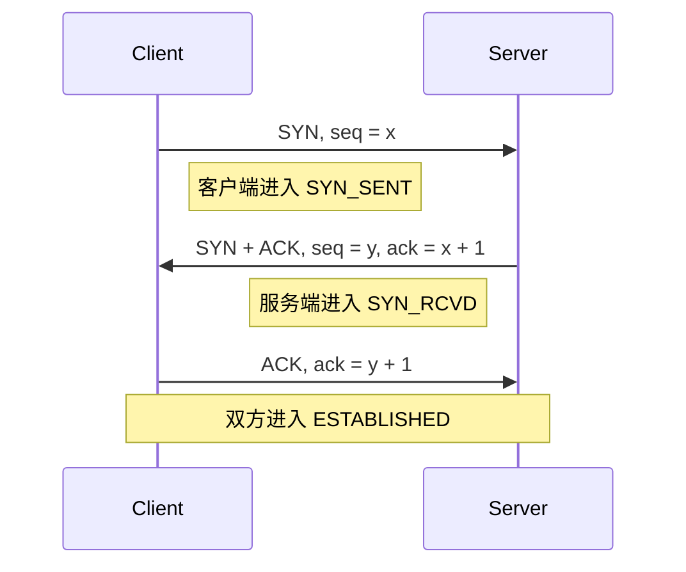
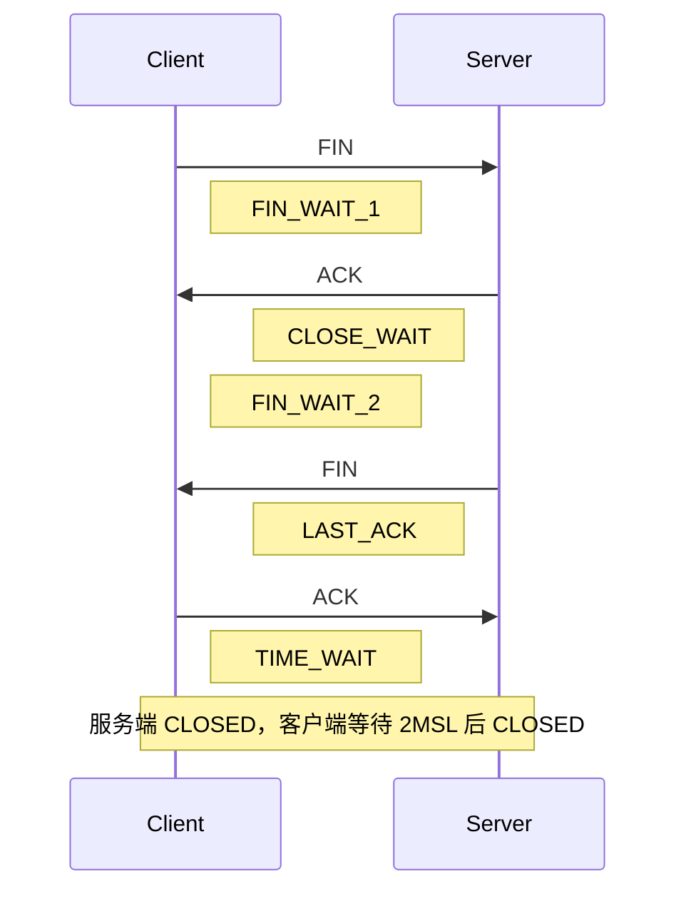

# TCP 连接建立与释放面试题

**适用场景：** 后端面试、网络基础复盘、线上连接状态排查。

**回答模板：** 先说结论，再说过程，再说为什么，最后补工程实践和排查思路。

## 目录

- [1. TCP 三次握手是什么？](#1-tcp-三次握手是什么)
  - [1.1 面试题](#11-面试题)
  - [1.2 标准回答](#12-标准回答)
  - [1.3 图示](#13-图示)
  - [1.4 举例理解](#14-举例理解)
  - [1.5 为什么不是两次握手？](#15-为什么不是两次握手)
  - [1.6 为什么不是四次握手？](#16-为什么不是四次握手)
  - [1.7 一句话背诵](#17-一句话背诵)
- [2. TCP 四次挥手是什么？](#2-tcp-四次挥手是什么)
  - [2.1 面试题](#21-面试题)
  - [2.2 标准回答](#22-标准回答)
  - [2.3 图示](#23-图示)
  - [2.4 举例理解](#24-举例理解)
  - [2.5 为什么挥手通常是四次？](#25-为什么挥手通常是四次)
  - [2.6 一句话背诵](#26-一句话背诵)
- [3. TIME_WAIT 是什么？](#3-time_wait-是什么)
  - [3.1 面试题](#31-面试题)
  - [3.2 标准回答](#32-标准回答)
  - [3.3 状态图](#33-状态图)
  - [3.4 为什么要等 2MSL？](#34-为什么要等-2msl)
    - [3.4.1 目的 1：保证最后一个 ACK 可靠到达](#341-目的-1保证最后一个-ack-可靠到达)
    - [3.4.2 目的 2：避免旧报文污染新连接](#342-目的-2避免旧报文污染新连接)
  - [3.5 举例理解](#35-举例理解)
  - [3.6 TIME_WAIT 过多有什么问题？](#36-time_wait-过多有什么问题)
  - [3.7 常见原因](#37-常见原因)
  - [3.8 如何治理 TIME_WAIT 过多？](#38-如何治理-time_wait-过多)
  - [3.9 一句话背诵](#39-一句话背诵)
- [4. CLOSE_WAIT 是什么？](#4-close_wait-是什么)
  - [4.1 面试题](#41-面试题)
  - [4.2 标准回答](#42-标准回答)
  - [4.3 状态图](#43-状态图)
  - [4.4 举例理解](#44-举例理解)
  - [4.5 CLOSE_WAIT 和 TIME_WAIT 的区别](#45-close_wait-和-time_wait-的区别)
  - [4.6 CLOSE_WAIT 过多如何排查？](#46-close_wait-过多如何排查)
    - [4.6.1 看连接属于哪个进程](#461-看连接属于哪个进程)
    - [4.6.2 看对端是谁](#462-看对端是谁)
    - [4.6.3 看代码有没有关闭资源](#463-看代码有没有关闭资源)
  - [4.7 一句话背诵](#47-一句话背诵)
- [5. 高频追问汇总](#5-高频追问汇总)
  - [5.1 追问 1：三次握手里每次握手分别确认了什么？](#51-追问-1三次握手里每次握手分别确认了什么)
  - [5.2 追问 2：服务端收到第三次握手前是什么状态？](#52-追问-2服务端收到第三次握手前是什么状态)
  - [5.3 追问 3：如果第三次握手的 ACK 丢了会怎样？](#53-追问-3如果第三次握手的-ack-丢了会怎样)
  - [5.4 追问 4：TIME_WAIT 一定出现在客户端吗？](#54-追问-4time_wait-一定出现在客户端吗)
  - [5.5 追问 5：CLOSE_WAIT 一定是服务端问题吗？](#55-追问-5close_wait-一定是服务端问题吗)
  - [5.6 追问 6：为什么 TIME_WAIT 要等 2MSL，不是 1MSL？](#56-追问-6为什么-time_wait-要等-2msl不是-1msl)
  - [5.7 追问 7：TIME_WAIT 能不能直接关掉？](#57-追问-7time_wait-能不能直接关掉)
  - [5.8 追问 8：大量 CLOSE_WAIT 怎么修？](#58-追问-8大量-close_wait-怎么修)
- [6. 面试口述版](#6-面试口述版)
  - [6.1 三次握手口述](#61-三次握手口述)
  - [6.2 四次挥手口述](#62-四次挥手口述)
  - [6.3 TIME_WAIT 口述](#63-time_wait-口述)
  - [6.4 CLOSE_WAIT 口述](#64-close_wait-口述)
- [7. 速记表](#7-速记表)

---

## 1. TCP 三次握手是什么？

### 1.1 面试题

TCP 三次握手的过程是什么？为什么需要三次？

### 1.2 标准回答

**TCP 三次握手是客户端和服务端在正式传输数据前，确认双方收发能力、同步初始序列号的过程。**

过程如下：

1. 客户端发送 `SYN` 给服务端，表示我想建立连接，并带上客户端初始序列号 `client_isn`。
2. 服务端收到后，回复 `SYN + ACK`，表示我收到了你的 `SYN`，同时也发送自己的初始序列号 `server_isn`。
3. 客户端再回复 `ACK`，表示我收到了你的 `SYN`，连接建立。

### 1.3 图示



ASCII 版：

```text
Client                                      Server
  |                                           |
  |  1. SYN(seq=x)                           |
  |------------------------------------------>|
  |                                           |
  |  2. SYN(seq=y) + ACK(ack=x+1)            |
  |<------------------------------------------|
  |                                           |
  |  3. ACK(ack=y+1)                         |
  |------------------------------------------>|
  |                                           |
  |              ESTABLISHED                 |
```

### 1.4 举例理解

可以把三次握手理解成打电话确认双方都能听见。

1. A：你能听到我吗？
2. B：我能听到你，你能听到我吗？
3. A：我也能听到你。

到这里，双方才确认：

- A 的发送能力正常，B 的接收能力正常。
- B 的发送能力正常，A 的接收能力正常。
- 双方都知道对方的初始序列号，后续可以可靠传输。

### 1.5 为什么不是两次握手？

两次握手只能让服务端确认客户端的发送能力和服务端的接收能力，不能让服务端确认客户端是否真的收到了自己的 `SYN + ACK`。

更重要的是，两次握手可能导致历史重复连接被错误建立。

例子：

```text
1. 客户端之前发过一个 SYN，但因为网络延迟迟迟没到服务端。
2. 客户端以为失败了，又重新发起连接并完成通信。
3. 过了一会儿，旧 SYN 到达服务端。
4. 如果只需要两次握手，服务端回复 ACK 后就可能直接认为连接建立。
5. 但客户端并不想建立这个旧连接，服务端会白白维护一个无效连接。
```

**第三次握手的意义是：客户端必须对服务端的确认再做一次确认，服务端才会进入真正可用的连接状态。**

### 1.6 为什么不是四次握手？

三次已经足够确认双方收发能力并同步双方初始序列号。

第二次握手里，服务端把两个动作合并了：

- `ACK`：确认收到了客户端的 `SYN`。
- `SYN`：发送自己的初始序列号。

如果拆开，确实可以变成四次：

```text
Client -> Server: SYN
Server -> Client: ACK
Server -> Client: SYN
Client -> Server: ACK
```

但中间两步可以合并成 `SYN + ACK`，所以三次就够了。

### 1.7 一句话背诵

**三次握手的核心不是单纯确认在线，而是确认双方收发能力正常，并交换双方初始序列号；两次不够可靠，四次没有必要。**

---

## 2. TCP 四次挥手是什么？

### 2.1 面试题

TCP 四次挥手的过程是什么？为什么建立连接是三次，断开连接却通常是四次？

### 2.2 标准回答

**TCP 是全双工协议**，可以理解成一条连接里有两个方向：

```text
客户端 -> 服务端：客户端的发送方向
客户端 <- 服务端：服务端的发送方向
```

建立连接时，双方都同意就可以开始通信；释放连接时，两个方向要分别关闭。一个方向关了，不代表另一个方向也马上关了，所以通常需要四次挥手。

假设客户端主动关闭：

1. 客户端发送 `FIN`：我这边不再发数据了。
2. 服务端回复 `ACK`：我知道你不发了。
3. 服务端处理完剩余数据后发送 `FIN`：我这边也不再发数据了。
4. 客户端回复 `ACK`：我知道你也不发了。

**注意：** `FIN` 的意思不是“整个连接马上没了”，而是“发送这个 FIN 的一方不再发送数据了”。

### 2.3 图示

先把三次握手和四次挥手放在同一张图里看：

```text
Client                                                Server
  |                                                     |
  |  三次握手：建立连接                                  |
  |                                                     |
  |  1. SYN                                             |
  |---------------------------------------------------->|
  |                                                     |
  |  2. SYN + ACK                                       |
  |<----------------------------------------------------|
  |                                                     |
  |  3. ACK                                             |
  |---------------------------------------------------->|
  |                                                     |
  |==================== ESTABLISHED ====================|
  |               双方可以同时收发数据                   |
  |                                                     |
  |  四次挥手：释放连接                                  |
  |                                                     |
  |  1. FIN                                             |
  |---------------------------------------------------->|
  |  Client: FIN_WAIT_1                                 |
  |                                                     |
  |  2. ACK                                             |
  |<----------------------------------------------------|
  |  Client: FIN_WAIT_2          Server: CLOSE_WAIT      |
  |                              服务端应用还没 close     |
  |                                                     |
  |              服务端可能还有数据要发                  |
  |                                                     |
  |  3. FIN                                             |
  |<----------------------------------------------------|
  |                              Server: LAST_ACK        |
  |                                                     |
  |  4. ACK                                             |
  |---------------------------------------------------->|
  |  Client: TIME_WAIT           Server: CLOSED          |
  |  等 2MSL 后 CLOSED                                  |
```

从这张图里记住两句话：

- `CLOSE_WAIT` 在被动关闭方，出现在“收到对方 FIN，并回了 ACK 之后”。
- `TIME_WAIT` 在主动关闭方，出现在“收到对方 FIN，并发出最后 ACK 之后”。



ASCII 版：

```text
Client                                      Server
  |                                           |
  |  1. FIN                                  |  客户端说：我不发了
  |------------------------------------------>|
  |                                           |
  |  2. ACK                                  |  服务端说：知道了
  |<------------------------------------------|
  |                                           |
  |  FIN_WAIT_2                 CLOSE_WAIT    |
  |                             服务端应用还没 close
  |                                           |
  |        服务端可能还在发送剩余数据          |
  |                                           |
  |  3. FIN                                  |  服务端说：我也不发了
  |<------------------------------------------|
  |                                           |
  |  4. ACK                                  |  客户端说：知道了
  |------------------------------------------>|
  |                                           |
  |  TIME_WAIT              LAST_ACK -> CLOSED|
  |  2MSL 后 CLOSED                          |
```

### 2.4 举例理解

可以理解成微信聊天结束。

1. A：我这边说完了，不再发消息了。
2. B：收到。
3. B：我这边也说完了，不再发消息了。
4. A：收到，那结束。

A 说完了，不代表 B 也马上说完。B 可能还有一些消息、日志、响应数据没发完，所以 `ACK` 和 `FIN` 通常要分开。

### 2.5 为什么挥手通常是四次？

建立连接时，服务端的 `SYN` 和 `ACK` 可以合并，因为服务端收到连接请求后，一般可以立刻表达“我也同意建立连接”。

关闭连接时，服务端收到 `FIN` 后，只能说明客户端不再发送数据了。服务端自己可能还有响应、日志、缓冲区数据没有发完，所以它通常只能先回 `ACK`，等自己也发完了，再单独发 `FIN`。

所以关闭连接通常是：

```text
FIN -> ACK -> FIN -> ACK
```

不过如果服务端也正好没有数据要发，第二次和第三次也可能合并为 `FIN + ACK`，此时看起来像三次挥手。

### 2.6 一句话背诵

**四次挥手的本质是 TCP 全双工连接的两个方向要分别关闭；收到对方 `FIN` 只代表对方不发了，不代表自己也马上能关闭。**

---

## 3. TIME_WAIT 是什么？

### 3.1 面试题

`TIME_WAIT` 是什么？为什么主动关闭方要等待 `2MSL`？能不能直接去掉？

### 3.2 标准回答

**`TIME_WAIT` 是主动关闭方在四次挥手最后一步之后进入的状态。**

还是假设客户端主动关闭：

```text
Client                                                Server
  |                                                     |
  |  1. FIN                                             |
  |---------------------------------------------------->|
  |                                                     |
  |  2. ACK                                             |
  |<----------------------------------------------------|
  |                                                     |
  |  3. FIN                                             |
  |<----------------------------------------------------|
  |                                                     |
  |  4. ACK                                             |
  |---------------------------------------------------->|
  |  进入 TIME_WAIT                                     |
  |  继续等 2MSL                                        |
  |                                                     |
  v                                                     v
 CLOSED                                               CLOSED
```

所以，`TIME_WAIT` 可以先粗暴记成：

> **主动关闭方发出最后一个 `ACK` 后，不会立刻消失，而是先等一会儿。**

`MSL` 是 Maximum Segment Lifetime，表示报文在网络中的最大生存时间。等待 `2MSL` 主要有两个目的：

1. 确保最后一个 `ACK` 能被对方收到。
2. 让这个连接产生的旧报文在网络中自然消失，避免影响后续相同四元组的新连接。

四元组指：

```text
源 IP、源端口、目标 IP、目标端口
```

### 3.3 状态图

```text
主动关闭方：

ESTABLISHED
    |
    | 发送 FIN：我不发了
    v
FIN_WAIT_1
    |
    | 收到 ACK：对方知道我不发了
    v
FIN_WAIT_2
    |
    | 收到对方 FIN：对方也不发了
    | 回复最后一个 ACK：我知道了
    v
TIME_WAIT
    |
    | 等待 2MSL
    v
CLOSED
```

### 3.4 为什么要等 2MSL？

#### 3.4.1 目的 1：保证最后一个 ACK 可靠到达

如果客户端发送最后一个 `ACK` 后立刻关闭，而这个 `ACK` 在网络中丢了，服务端会一直停在 `LAST_ACK`，并重传 `FIN`。

有了 `TIME_WAIT`：

```text
Client                                                Server
  |                                                     |
  |  最后一个 ACK 丢了                                  |
  |--------------------X                                |
  |  Client 还在 TIME_WAIT                              |
  |                                                     |
  |  Server 收不到 ACK，于是重传 FIN                     |
  |<----------------------------------------------------|
  |                                                     |
  |  Client 还能再回一次 ACK                            |
  |---------------------------------------------------->|
  |                                                     |
  |                              Server 收到后 CLOSED    |
```

也就是说，`TIME_WAIT` 是主动关闭方在“门口等一下”。如果对方没收到最后确认，它还能补一句“我真的收到了”。

#### 3.4.2 目的 2：避免旧报文污染新连接

假设没有 `TIME_WAIT`，客户端马上复用同一个四元组建立新连接。网络中旧连接的延迟报文突然到达，可能被新连接误认为是合法数据。

等待 `2MSL` 可以让：

- 旧连接最后发出的报文最多经过 `1MSL` 消失。
- 对端重传的报文最多再经过 `1MSL` 消失。

所以等待 `2MSL` 后，旧连接的残留报文基本都消失了。

### 3.5 举例理解

把 `TIME_WAIT` 想成离开会议室前的等待。

你说“收到，我走了”，但你没有马上锁门离开，而是在门口等一小会儿。原因是：

- 如果对方没听清，又喊一句“你确认收到了吗？”，你还能回答。
- 等上一场会议的人和文件都清空后，下一场会议再进来，不会把旧材料当成新的。

### 3.6 TIME_WAIT 过多有什么问题？

**`TIME_WAIT` 本身不是错误，它是 TCP 正常关闭连接的结果。** 但太多会带来资源压力。

常见影响：

- 占用本机端口，尤其是客户端高频短连接时容易耗尽临时端口。
- 占用少量内核连接状态资源。
- 在高 QPS 短连接场景下，可能导致新连接建立失败或延迟升高。

### 3.7 常见原因

`TIME_WAIT` 多通常说明本机是大量连接的主动关闭方。

典型场景：

- 服务主动关闭了大量客户端连接。
- 网关、代理、爬虫、压测客户端频繁创建短连接。
- HTTP 没有开启 keep-alive，或者连接复用效果差。
- 客户端连接池配置不合理，频繁建连和断连。

### 3.8 如何治理 TIME_WAIT 过多？

优先从架构和连接复用入手：

1. 使用长连接和连接池，减少短连接。
2. HTTP 开启 keep-alive，RPC 客户端复用连接。
3. 调整客户端连接池大小、空闲超时和最大生命周期。
4. 优化服务端主动关闭策略，避免频繁踢连接。
5. 必要时扩大临时端口范围，例如 Linux 的 `ip_local_port_range`。
6. 在理解风险后调整内核参数，例如复用 `TIME_WAIT` 连接的相关配置。

面试里不要一上来就说“改内核参数”。更好的回答顺序是：先确认连接模式，再看是否短连接过多，再做连接复用，最后才考虑内核参数。

### 3.9 一句话背诵

**`TIME_WAIT` 是主动关闭方为了可靠结束连接和避免旧报文污染新连接而等待 `2MSL` 的状态；它不是 bug，过多时优先治理短连接和连接复用。**

---

## 4. CLOSE_WAIT 是什么？

### 4.1 面试题

`CLOSE_WAIT` 是什么？线上看到大量 `CLOSE_WAIT` 一般说明什么？

### 4.2 标准回答

**`CLOSE_WAIT` 是被动关闭方收到对端 `FIN` 并回复 `ACK` 后进入的状态。**

还是假设客户端主动关闭，服务端就是被动关闭方：

```text
Client                                                Server
  |                                                     |
  |  1. FIN：客户端不发了                               |
  |---------------------------------------------------->|
  |                                                     |
  |  2. ACK：服务端知道了                               |
  |<----------------------------------------------------|
  |                                                     |
  |                              Server: CLOSE_WAIT      |
  |                              含义：对方不发了，       |
  |                              但我这边应用还没 close   |
```

所以，`CLOSE_WAIT` 可以先粗暴记成：

> **对方已经说“不发了”，本端内核也回了“知道了”，但本端应用还没有说“我也不发了”。**

如果线上出现大量 `CLOSE_WAIT`，通常说明**本端程序没有及时关闭 socket**，常见原因是代码层面连接泄漏、阻塞、异常路径没有释放资源。

### 4.3 状态图

```text
被动关闭方：

ESTABLISHED
    |
    | 收到对方 FIN：对方不发了
    | 内核回复 ACK：知道了
    v
CLOSE_WAIT
    |
    | 应用调用 close()
    | 内核发送 FIN：我也不发了
    v
LAST_ACK
    |
    | 收到对方 ACK
    v
CLOSED
```

### 4.4 举例理解

对方已经说“我讲完了”，你也回了“收到”，但是你自己的程序迟迟不说“我也讲完了”。于是连接就卡在 `CLOSE_WAIT`。

它不像 `TIME_WAIT` 那样会自动等一段时间结束。`CLOSE_WAIT` 依赖应用程序主动关闭。

更直白地说：

```text
TIME_WAIT:
  内核会帮你等 2MSL，然后自动结束。

CLOSE_WAIT:
  内核已经做完能做的事了，接下来要等应用调用 close()。
  应用不 close，它就可能一直卡着。
```

### 4.5 CLOSE_WAIT 和 TIME_WAIT 的区别

| 对比项 | *TIME_WAIT* | *CLOSE_WAIT* |
| --- | --- | --- |
| 出现在哪一方 | 主动关闭方 | 被动关闭方 |
| 出现在哪一步 | 发出最后一个 `ACK` 后 | 收到 `FIN` 并回 `ACK` 后 |
| 是否正常 | 正常状态 | 少量正常，大量通常异常 |
| 是否会自动结束 | 会，等待 `2MSL` 后结束 | 不会，依赖应用调用 `close()` |
| 常见原因 | 短连接多、主动关闭多 | 程序没有正确关闭 socket |
| 排查重点 | 连接复用、端口范围、短连接来源 | 代码泄漏、异常路径、阻塞线程 |

### 4.6 CLOSE_WAIT 过多如何排查？

#### 4.6.1 看连接属于哪个进程

```bash
lsof -iTCP -sTCP:CLOSE_WAIT -nP
```

或者：

```bash
ss -tanp state close-wait
```

#### 4.6.2 看对端是谁

如果大量连接来自同一个下游服务，可能是：

- 下游主动关闭连接。
- 本服务连接池没有感知连接关闭。
- 客户端读写异常后没有释放连接。

#### 4.6.3 看代码有没有关闭资源

重点检查：

- Java 里 `Socket`、`InputStream`、`OutputStream`、HTTP response body 是否关闭。
- Go 里 `resp.Body.Close()` 是否执行。
- 连接池借出的连接是否归还。
- 异常分支、超时分支、提前 return 分支是否释放资源。
- 线程是否卡在读写、锁等待、下游调用里，导致无法执行 close。

Go 示例：

```go
resp, err := http.Get(url)
if err != nil {
    return err
}
defer resp.Body.Close()
```

Java 示例：

```java
try (Response response = client.newCall(request).execute()) {
    return response.body().string();
}
```

### 4.7 一句话背诵

**`CLOSE_WAIT` 表示对端已经关闭发送方向，本端也确认了，但本端应用还没关闭 socket；大量 `CLOSE_WAIT` 基本优先怀疑代码没有正确释放连接。**

---

## 5. 高频追问汇总

### 5.1 追问 1：三次握手里每次握手分别确认了什么？

```text
第一次：服务端知道客户端能发，服务端能收。
第二次：客户端知道自己能发能收，服务端能发能收。
第三次：服务端知道客户端能收，最终双方确认收发能力都正常。
```

### 5.2 追问 2：服务端收到第三次握手前是什么状态？

服务端收到客户端 `SYN` 并回复 `SYN + ACK` 后，进入 `SYN_RCVD` 状态。收到客户端第三次 `ACK` 后，进入 `ESTABLISHED` 状态。

### 5.3 追问 3：如果第三次握手的 ACK 丢了会怎样？

服务端收不到第三次 `ACK`，会重传 `SYN + ACK`。客户端收到后会再次回复 `ACK`。

如果客户端已经开始发送数据，数据包里也会带 `ACK`，服务端收到合法数据后也可以进入 `ESTABLISHED`。

### 5.4 追问 4：TIME_WAIT 一定出现在客户端吗？

不一定。`TIME_WAIT` 出现在主动关闭连接的一方。

大多数普通 HTTP 请求里，客户端常常主动关闭，所以客户端更容易看到 `TIME_WAIT`。但如果服务端主动关闭连接，服务端也会出现 `TIME_WAIT`。

### 5.5 追问 5：CLOSE_WAIT 一定是服务端问题吗？

不一定。`CLOSE_WAIT` 出现在被动关闭方。

如果客户端收到服务端 `FIN` 后没有及时关闭 socket，客户端也会出现 `CLOSE_WAIT`。线上服务端大量 `CLOSE_WAIT` 常见，是因为服务端连接多、常驻进程更容易暴露资源泄漏。

### 5.6 追问 6：为什么 TIME_WAIT 要等 2MSL，不是 1MSL？

因为要覆盖两个方向的报文生命周期：

1. 最后一个 `ACK` 到达对端，最多需要 `1MSL`。
2. 如果这个 `ACK` 丢失，对端重传 `FIN` 回来，最多还需要 `1MSL`。

所以主动关闭方等待 `2MSL`，可以处理最后 `ACK` 丢失导致的重传，也可以让旧报文从网络中消失。

### 5.7 追问 7：TIME_WAIT 能不能直接关掉？

面试中不要回答“直接关掉”。

更稳的回答是：

**`TIME_WAIT` 是 TCP 正确性的一部分，不能简单去掉。** 大量 `TIME_WAIT` 时，应该优先减少短连接、提升连接复用、优化连接池和主动关闭策略。只有在明确业务场景和风险后，才考虑调整内核参数。

### 5.8 追问 8：大量 CLOSE_WAIT 怎么修？

**核心是修应用代码。**

排查顺序：

1. 用 `ss` / `lsof` 找到进程和对端。
2. 看代码是否关闭 response body、socket、stream。
3. 看异常路径是否漏掉 `close()`。
4. 看线程是否阻塞，导致 close 逻辑执行不到。
5. 看连接池是否正确回收和剔除失效连接。

---

## 6. 面试口述版

### 6.1 三次握手口述

**TCP 三次握手是建立连接前同步双方初始序列号、确认双方收发能力的过程。** 第一次客户端发 `SYN`，第二次服务端回 `SYN + ACK`，第三次客户端回 `ACK`，之后双方进入 `ESTABLISHED`。两次不够，因为服务端不能确认客户端是否收到了自己的确认，也可能因为历史延迟 `SYN` 导致错误连接。四次没必要，因为服务端的 `SYN` 和 `ACK` 可以合并。

### 6.2 四次挥手口述

**TCP 是全双工协议，两个方向要分别关闭。** 主动关闭方先发 `FIN`，被动关闭方回 `ACK`，表示收到了关闭请求；等被动关闭方自己的数据也发完，再发 `FIN`，主动关闭方回最后一个 `ACK`。所以通常是四次。建立连接时 `SYN` 和 `ACK` 可以合并，但关闭时收到 `FIN` 不代表自己也没数据要发，所以通常不能合并。

### 6.3 TIME_WAIT 口述

**`TIME_WAIT` 出现在主动关闭方，发送最后一个 `ACK` 后会等待 `2MSL`。** 它有两个作用：第一，保证最后一个 `ACK` 丢失时还能收到对端重传的 `FIN` 并再次确认；第二，让旧连接的历史报文在网络中消失，避免污染后续相同四元组的新连接。`TIME_WAIT` 多不一定是问题，通常说明短连接或主动关闭多，优先通过长连接、连接池、keep-alive 和减少主动关闭来治理。

### 6.4 CLOSE_WAIT 口述

**`CLOSE_WAIT` 出现在被动关闭方。** 它表示本端收到了对端 `FIN`，也回了 `ACK`，但本端应用还没有调用 `close()`。少量短暂存在正常，大量堆积通常说明应用层连接没有释放，比如 response body 没关、异常路径没 close、连接池没回收，或者线程阻塞导致 close 逻辑执行不到。排查时先用 `ss` 或 `lsof` 找进程和对端，再查代码释放路径。

---

## 7. 速记表

| 知识点 | 核心结论 |
| --- | --- |
| 三次握手 | 确认双方收发能力，同步双方初始序列号 |
| 不是两次 | 服务端无法确认客户端收到了自己的 `SYN + ACK`，也容易受历史 `SYN` 影响 |
| 不是四次 | 服务端的 `SYN` 和 `ACK` 可以合并 |
| 四次挥手 | TCP 全双工，两个方向分别关闭 |
| TIME_WAIT | 主动关闭方等待 `2MSL`，保证最后 ACK 和清理旧报文 |
| TIME_WAIT 多 | 多见于短连接和主动关闭多，优先做连接复用 |
| CLOSE_WAIT | 被动关闭方等应用调用 `close()` |
| CLOSE_WAIT 多 | 高概率是代码连接泄漏或释放路径有问题 |
